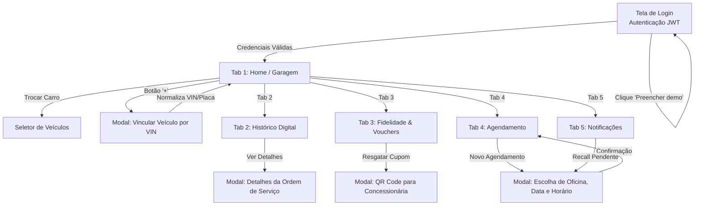
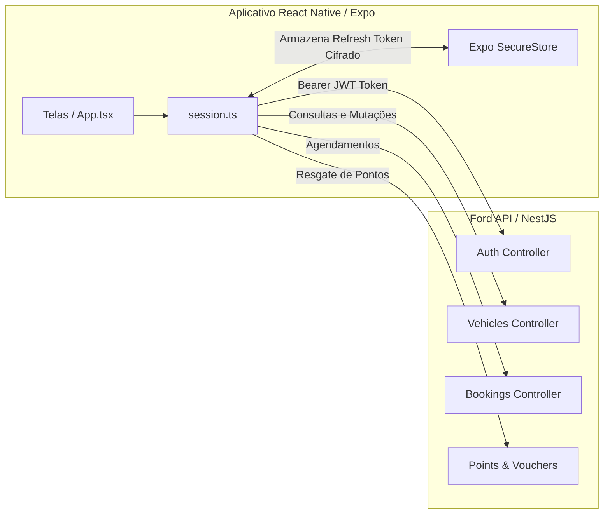

# Ford Vínculo 360 — Aplicativo Mobile do Proprietário
**FIAP 2026 | Desafio Ford — Sprint 3: Mobile Development and IoT**

---

## 📋 Sumário Executivo

| Item | Detalhe |
| :--- | :--- |
| **Projeto** | Ford Vínculo 360 (Mobile) |
| **Desafio** | Desafio 02 — Impulsionando o VIN Share na América do Sul com Soluções Inteligentes |
| **Disciplina** | Mobile Development and IoT |
| **Sprint** | Sprint 3 (Entrega avaliativa) |
| **Stack** | React Native 0.81, Expo SDK 54, TypeScript 5.9, Expo SecureStore, Lucide Icons |
| **Formato de Entrega** | APK Android compilável via Expo EAS Build + Código-fonte + README com demonstração visual |
| **Credenciais de Teste** | `carlos@ford360.local` \| Senha: `Ford@360` (ou botão *"Preencher demo"* na tela) |

---

## 🎯 1. O Desafio e o Papel Estratégico do App Mobile

No setor automotivo, a retenção de clientes na rede de pós-venda (*VIN Share*) sofre uma queda expressiva após o término do período de garantia contratual. Os clientes frequentemente deixam de frequentar as concessionárias autorizadas por falta de visibilidade sobre o plano de manutenção, percepção de custo ou simplesmente por troca de proprietário do automóvel.

O **Ford Vínculo 360 Mobile** foi concebido para resolver essa dor na raiz:
1. **Passaporte Digital Permanente do Veículo:** O histórico de manutenções, peças e revisões fica atrelado ao **chassi (VIN)**, e não apenas ao dono inicial. Quando o carro é vendido, o novo proprietário reivindica o veículo no app e recebe todo o histórico de valorização do carro na rede Ford (respeitando integralmente a LGPD, sem exibir dados cadastrais do dono anterior).
2. **Incentivo Econômico à Fidelização:** Cada serviço realizado na concessionária gera **pontos de fidelidade**, que são trocados diretamente no app por **vouchers de desconto** em revisões, troca de óleo e peças originais Ford.
3. **Agendamento em Poucos Toques:** Conexão direta com a agenda das oficinas de todas as concessionárias credenciadas Ford do país.
4. **Segurança Proativa:** Alertas imediatos de recall oficial da montadora e lembretes preditivos de manutenção antes de avarias mecânicas.

---

## 🎨 2. Identidade Visual e Design System

O aplicativo foi projetado seguindo as diretrizes oficiais de identidade visual da Ford Motor Company, combinando sobriedade, sofisticação e usabilidade intuitiva:

### 2.1 Paleta de Cores
| Token | Cor Hex | Uso Principal |
| :--- | :---: | :--- |
| `navy` | `#061d36` | Barra superior, cards de destaque, splash e identidade corporativa |
| `navyDeep` | `#0a426e` | Gradientes de fundo, cabeçalhos de seções e modais |
| `blue` | `#0878bd` | Ações principais, botões primários e links de navegação |
| `bright` | `#1b9be8` | Elementos ativos na tab bar, destaques de telemetria e badges |
| `sky` | `#70c7ee` | Realces secundários, bordas ativas e ícones de suporte |
| `bg` | `#eef4f7` | Fundo geral da aplicação com alto contraste e conforto visual |
| `card` | `#ffffff` | Superfície dos cards de conteúdo e modais inferiores (*bottom sheets*) |
| `ink` | `#162b3e` | Tipografia de títulos e informações numéricas principais |
| `body` | `#3c5266` | Textos explicativos e legendas |
| `muted` | `#637488` | Rótulos secundários, placeholders e dados técnicos discretos |

### 2.2 Componentes e Tipografia
* **Ícones Vetoriais:** Biblioteca oficial `lucide-react-native`, padronizada em 18px a 24px com feedback de toque.
* **Fotos de Estúdio de Alta Resolução:** Imagens renderizadas em estúdio fotográfico dos modelos mais emblemáticos da Ford no Brasil (*Ford Territory Titanium, Ranger Raptor / Limited, Maverick Lariat, Bronco Sport, Mustang Mach-E e F-150*).
* **Feedback Tátil e Estados:** Estados explícitos de carregamento (*ActivityIndicator* estilizado), tratamento de erro com retry e badges dinâmicos para notificações não lidas.

---

## 🗺️ 3. Diagrama de Arquitetura e Fluxo de Navegação

### 3.1 Fluxo de Navegação do Usuário


### 3.2 Arquitetura de Comunicação e Segurança


---

## 📱 4. Demonstração Visual de Todas as Telas

Abaixo estão detalhados os componentes visuais, funcionalidades e layout de cada interface do aplicativo:

---

### 1️⃣ Tela de Login e Acesso Seguro
Permite ao condutor autenticar-se na plataforma com credenciais seguras. Inclui atalho de demonstração para facilitar a avaliação acadêmica.

```
┌──────────────────────────────────────────────┐
│  [Logo Ford]                                 │
│  Ford Vínculo 360                            │
│  Sua conexão definitiva com a rede Ford      │
│                                              │
│  E-MAIL                                      │
│  [ carlos@ford360.local                    ] │
│                                              │
│  SENHA                                       │
│  [ ••••••••••                            👁 ] │
│                                              │
│  [          ENTRAR NO APLICATIVO           ] │
│                                              │
│  ┌────────────────────────────────────────┐  │
│  │ ⚡ AVALIAÇÃO RÁPIDA:                   │  │
│  │ [ Preencher demo (carlos@ford360.local) ]│ │
│  └────────────────────────────────────────┘  │
│                                              │
│  🔒 Sessão cifrada em hardware via SecureStore│
└──────────────────────────────────────────────┘
```
* **Recursos:**
  * Validação de formato de e-mail e visibilidade da senha (mostrar/ocultar).
  * Botão de preenchimento rápido em um clique (*carlos@ford360.local / Ford@360*).
  * Tratamento de falhas de rede com mensagens claras em português.

---

### 2️⃣ Tela Home: Garagem Digital (Tab: `Home`)
Painel central do proprietário com resumo em tempo real do estado do automóvel selecionado.

```
┌──────────────────────────────────────────────┐
│  GARAGEM DIGITAL              [Sair / Logout]│
│  Olá, Carlos Henrique                        │
│                                              │
│  [ < ]     Ford Territory Titanium     [ > ] │
│  ┌────────────────────────────────────────┐  │
│  │        [ Foto de Estúdio Real ]        │  │
│  │                                        │  │
│  │  Placa: ABC-1D23   •   Ano: 2024       │  │
│  │  Chassi: 9BF••••••••••219              │  │
│  └────────────────────────────────────────┘  │
│                                              │
│  STATUS DE SAÚDE & REVISÃO                   │
│  ┌────────────────────────────────────────┐  │
│  │ ⚡ Quilometragem: 38.450 km            │  │
│  │ 📅 Próxima revisão: 40.000 km          │  │
│  │ ⏱ Faltam apenas 1.550 km ou 45 dias   │  │
│  └────────────────────────────────────────┘  │
│                                              │
│  AÇÕES RÁPIDAS:                              │
│  [📅 Agendar]  [📋 Histórico]  [🎁 Pontos]   │
│                                              │
│  PRÓXIMO AGENDAMENTO CONFIRMADO:             │
│  ┌────────────────────────────────────────┐  │
│  │ Concessionária: Ford Nações Unidas     │  │
│  │ Data: 14/10/2026 às 09:30              │  │
│  │ Serviço: Revisão dos 40.000 km         │  │
│  └────────────────────────────────────────┘  │
├──────────────────────────────────────────────┤
│ [🏠 Home] [📋 Histórico] [🎁 Pontos] [📅 Agenda] [🔔 Avisos]│
└──────────────────────────────────────────────┘
```
* **Recursos:**
  * **Carrossel de Garagem:** Suporte a múltiplos veículos vinculados à mesma conta.
  * **Foto Real de Estúdio:** Imagem fiel do modelo com sombra e acabamento premium.
  * **Hodômetro Inteligente:** Projeção calculada da data da próxima manutenção preventiva.

---

### 3️⃣ Modal de Vinculação de Veículo (`Reivindicar Veículo`)
Permite ao novo comprador incluir seu automóvel na garagem digital inserindo o chassi e placa.

```
┌──────────────────────────────────────────────┐
│ (X) Fechar                                   │
│ VINCULAR NOVO VEÍCULO                        │
│ Associe seu Ford para acessar o prontuário   │
│                                              │
│ NÚMERO DO CHASSI (VIN)                       │
│ [ 9BFEB55P4R8123219                        ] │
│ ℹ️ 17 caracteres alfanuméricos encontrados no │
│ documento do veículo (CRLV) ou nos vidros.    │
│                                              │
│ PLACA DO VEÍCULO                             │
│ [ ABC1D23                                  ] │
│ Padrão Mercosul (ABC1D23) ou antigo (ABC1234)│
│                                              │
│ [       VINCULAR À MINHA GARAGEM           ] │
│                                              │
│ 🛡️ O histórico do veículo será transferido    │
│ preservando o sigilo do dono anterior (LGPD). │
└──────────────────────────────────────────────┘
```
* **Recursos:**
  * Normalização em tempo real (remoção de hifens, espaços, letras minúsculas).
  * Validação de 17 caracteres do padrão internacional VIN (ISO 3779).
  * Transferência imediata de titularidade técnica sem apagar ordens de serviço anteriores.

---

### 4️⃣ Tela de Histórico Contínuo (Tab: `History`)
O verdadeiro "Passaporte Digital do Veículo" que valoriza o seminovo Ford na hora da revenda.

```
┌──────────────────────────────────────────────┐
│ HISTÓRICO DO VEÍCULO                         │
│ Ford Territory Titanium • Placa: ABC-1D23    │
│                                              │
│ ┌──────────────────────────────────────────┐ │
│ │ 🟢 Revisão de 30.000 km                  │ │
│ │ 📅 23/08/2026  •  37.800 km               │ │
│ │ 🏢 Ford Nações Unidas - São Paulo/SP     │ │
│ │ 🔧 Troca de óleo, filtro de cabine,      │ │
│ │    pastilhas dianteiras e rodízio.       │ │
│ │ ⭐ +1.800 pontos acumulados              │ │
│ └──────────────────────────────────────────┘ │
│                                              │
│ ┌──────────────────────────────────────────┐ │
│ │ 🟢 Revisão de 20.000 km                  │ │
│ │ 📅 10/01/2026  •  28.100 km               │ │
│ │ 🏢 Ford Ibirapuera - São Paulo/SP        │ │
│ │ 🔧 Substituição de velas, filtro de ar e │ │
│ │    fluido de freio.                      │ │
│ │ ⭐ +1.500 pontos acumulados              │ │
│ └──────────────────────────────────────────┘ │
│                                              │
│ ┌──────────────────────────────────────────┐ │
│ │ 🟢 Entrega Técnica (Revisão 10.000 km)   │ │
│ │ 📅 20/07/2025  •  15.600 km               │ │
│ │ 🏢 Ford Nações Unidas                    │ │
│ │ ⭐ +1.200 pontos acumulados              │ │
│ └──────────────────────────────────────────┘ │
├──────────────────────────────────────────────┤
│ [🏠 Home] [📋 Histórico] [🎁 Pontos] [📅 Agenda] [🔔 Avisos]│
└──────────────────────────────────────────────┘
```
* **Recursos:**
  * Timeline cronológica decrescente.
  * Detalhe da concessionária oficial que executou cada serviço.
  * Pontuação ganha em cada passagem pela concessionária.

---

### 5️⃣ Tela de Fidelidade & Vouchers (Tab: `Points`)
O motor financeiro que atrai o condutor de volta para a rede autorizada.

```
┌──────────────────────────────────────────────┐
│ PROGRAMA FORD VÍNCULO PONTOS                 │
│                                              │
│ ┌──────────────────────────────────────────┐ │
│ │ SALDO DISPONÍVEL                         │ │
│ │ ⭐ 4.500 PONTOS                          │ │
│ │ Equivale a R$ 225,00 em benefícios       │ │
│ └──────────────────────────────────────────┘ │
│                                              │
│ VOUCHERS DISPONÍVEIS PARA RESGATE:           │
│                                              │
│ ┌──────────────────────────────────────────┐ │
│ │ 🎁 Desconto de R$ 150 em Revisão         │ │
│ │ Válido para qualquer revisão programada  │ │
│ │ Custo: 3.000 pontos                      │ │
│ │ [ RESGATAR ESTE VOUCHER ]                │ │
│ └──────────────────────────────────────────┘ │
│                                              │
│ ┌──────────────────────────────────────────┐ │
│ │ 🎁 Alinhamento & Balanceamento 3D Grátis │ │
│ │ Custo: 1.500 pontos                      │ │
│ │ [ RESGATAR ESTE VOUCHER ]                │ │
│ └──────────────────────────────────────────┘ │
│                                              │
│ MEUS VOUCHERS ATIVOS:                        │
│ 🎟️ VOUCHER-REV-40K [Ver QR Code]            │
├──────────────────────────────────────────────┤
│ [🏠 Home] [📋 Histórico] [🎁 Pontos] [📅 Agenda] [🔔 Avisos]│
└──────────────────────────────────────────────┘
```
* **Recursos:**
  * Extrato claro de pontuação e valor percebido.
  * Catálogo de benefícios com validação de saldo suficiente.
  * Emissão de voucher com QR Code único para leitura direta pelo consultor no balcão da concessionária.

---

### 6️⃣ Tela de Agendamento de Serviços (Tab: `Bookings`)
Fluxo direto e sem atrito para marcar a manutenção do veículo.

```
┌──────────────────────────────────────────────┐
│ AGENDAMENTOS NA REDE AUTORIZADA              │
│                                              │
│ [ + SOLICITAR NOVO AGENDAMENTO ]             │
│                                              │
│ AGENDAMENTOS EM ABERTO:                      │
│ ┌──────────────────────────────────────────┐ │
│ │ 🟡 AGENDADO / CONFIRMADO                 │ │
│ │ Revisão Preventiva de 40.000 km          │ │
│ │ 📅 14 de Outubro de 2026 às 09:30        │ │
│ │ 📍 Ford Nações Unidas - São Paulo/SP     │ │
│ │ Veículo: Territory Titanium (ABC-1D23)   │ │
│ │                                          │ │
│ │ [ ❌ Cancelar ]      [ 📍 Ver Endereço ] │ │
│ └──────────────────────────────────────────┘ │
│                                              │
│ HISTÓRICO DE AGENDAMENTOS CONCLUÍDOS:        │
│ ✔️ Revisão de 30.000 km (Concluído em 23/08) │
│ ✔️ Troca de Pastilhas (Concluído em 10/01)   │
├──────────────────────────────────────────────┤
│ [🏠 Home] [📋 Histórico] [🎁 Pontos] [📅 Agenda] [🔔 Avisos]│
└──────────────────────────────────────────────┘
```
* **Recursos:**
  * Modal seletor de serviço (Revisão Periódica, Diagnóstico Mecânico, Troca de Freios, Recall).
  * Seleção da concessionária mais próxima.
  * Grade dinâmica de horários para escolha do proprietário.

---

### 7️⃣ Central de Alertas e Notificações (Tab: `Alertas`)
Avisos críticos de segurança e lembretes preventivos.

```
┌──────────────────────────────────────────────┐
│ CENTRAL DE NOTIFICAÇÕES & SEGURANÇA          │
│                                              │
│ ┌──────────────────────────────────────────┐ │
│ │ 🚨 RECALL OFICIAL FORD (URGENTE)         │ │
│ │ Campanha 24S12 — Módulo de Airbag        │ │
│ │ O seu veículo necessita de inspeção      │ │
│ │ gratuita do software de acionamento.     │ │
│ │ [ AGENDAR RECALL GRATUITO AGORA ]        │ │
│ └──────────────────────────────────────────┘ │
│                                              │
│ ┌──────────────────────────────────────────┐ │
│ │ 📅 REVISÃO DE 40.000 KM SE APROXIMANDO   │ │
│ │ Faltam menos de 1.500 km para o prazo da │ │
│ │ sua próxima revisão preventiva de fábrica│ │
│ │ [ Agendar Horário ]                      │ │
│ └──────────────────────────────────────────┘ │
│                                              │
│ ┌──────────────────────────────────────────┐ │
│ │ ⭐ PONTOS ACUMULADOS                     │ │
│ │ Você recebeu 1.800 pontos pelo último    │ │
│ │ serviço na Concessionária Nações Unidas. │ │
│ └──────────────────────────────────────────┘ │
├──────────────────────────────────────────────┤
│ [🏠 Home] [📋 Histórico] [🎁 Pontos] [📅 Agenda] [🔔 Avisos]│
└──────────────────────────────────────────────┘
```
* **Recursos:**
  * Destaque com ícone de alerta vermelho para recalls não atendidos.
  * Badge numérico na tab bar indicando notificações não lidas.
  * Links diretos para ações de resolução em um toque.

---

## ⚙️ 5. Como Executar o Aplicativo Localmente

O aplicativo mobile pode ser executado em três modos distintos:

### Modo 1: Execução no Navegador Web (Mais Rápido para Avaliação)
Com a API do Ford Vínculo 360 ativa na porta 3000:
```powershell
# Na raiz do projeto:
pnpm dev:mobile
# Ou diretamente na pasta apps/mobile:
npm start -- --web
```
Acesse: **`http://127.0.0.1:8081`** no navegador. O app simula o container de smartphone na tela com alternador de modelos, preenchimento de login com 1 clique e todas as abas interativas.

### Modo 2: Execução em Emulador Android (Android Studio)
1. Inicie seu emulador Android pelo Android Studio (Virtual Device Manager).
2. Execute o comando:
   ```powershell
   cd apps/mobile
   npm run android
   ```
3. O Expo compilará o bundle e instalará o app automaticamente no emulador conectado. A comunicação com o backend no mesmo PC ocorre de forma transparente via `http://10.0.2.2:3000/api/v1`.

### Modo 3: Execução em Celular Físico via Expo Go
1. Instale o app **Expo Go** pela Google Play Store no seu smartphone Android.
2. Certifique-se de que o computador e o smartphone estão conectados na **mesma rede Wi-Fi**.
3. Na pasta `apps/mobile`, execute `npx expo start`.
4. Aponte a câmera do celular para o QR Code gerado no terminal.

---

## 📦 6. Como Gerar o Arquivo APK Final (EAS Build)

Conforme solicitado no edital da Sprint 3, o projeto está completamente preparado para gerar o executável final **`.apk` para Android**.

### Opção A: Script Automatizado (Recomendado)
Criamos um script na raiz que valida os testes de contrato e sessão e dispara o build do APK:
```powershell
powershell -ExecutionPolicy Bypass -File scripts/build-mobile-apk.ps1
```

### Opção B: Comando Direto via EAS Build (Nuvem Expo - Gratuito)
1. Certifique-se de estar com login no Expo:
   ```bash
   npx -y eas-cli login
   ```
2. Na pasta `apps/mobile`:
   ```bash
   npm run build:apk
   ```
   *(Executa internamente: `eas build -p android --profile preview`)*
3. Ao finalizar, o terminal exibirá o link de download direto do arquivo `.apk` pronto para entrega e um QR Code para download imediato pelo celular.

### Opção C: Build Local do APK (Sem fila de nuvem)
Se o computador possuir o Android SDK e o Java JDK 17 configurados:
```bash
cd apps/mobile
npm run build:apk:local
```
O arquivo `.apk` será gerado localmente na pasta `apps/mobile`.

---

## 📲 7. Como Instalar o APK Gerado

* **Em Dispositivo Físico Android:**
  1. Envie ou baixe o arquivo `ford-vinculo-360.apk` no smartphone.
  2. Toque no arquivo e autorize a instalação de fontes desconhecidas no Android.
  3. Abra o aplicativo e faça login com a conta de demonstração.
* **Em Emulador Android:**
  1. Abra o emulador.
  2. Arraste o arquivo `.apk` para a janela do emulador (ou rode `adb install ford-vinculo-360.apk`).

---

## 🧪 8. Testes Automatizados e Qualidade de Código

A robustez da aplicação é garantida por testes de tipagem estrita e testes automatizados unitários:

### 8.1 Verificação de Tipos TypeScript
```powershell
npm run typecheck --prefix apps/mobile
```
* **Resultado:** `Exit code 0` (0 erros de tipagem em todo o código React Native).

### 8.2 Testes Unitários de Sessão e Contrato
```powershell
node --test scripts/mobile-session.test.cjs scripts/mobile-contract.test.cjs
```

#### Cobertura dos 13 Testes Aprovados:
1. `claim normalizes VIN and plate before sending them to the API`: Garante remoção de espaços, caracteres especiais e padronização para 17 caracteres de chassi e placas Mercosul/antigas.
2. `upcoming agenda accepts only future requested or confirmed appointments`: Filtra compromissos passados ou cancelados da tela de agendamentos.
3. `agenda sorting is chronological, reversible, and does not mutate API data`: Ordenação imutável da agenda de serviços.
4. `the mobile UI consumes the tested helpers in claim and agenda flows`: Valida acoplamento dos helpers com a interface gráfica.
5. `native login stores only the refresh token and normalizes email`: Garante armazenamento seguro e normalização de e-mail.
6. `web login uses app cookies and removes legacy localStorage tokens`: Suporte transparente ao modo web.
7. `web restore rotates the owner cookie without exposing a refresh token`: Segurança de cookies HttpOnly.
8. `parallel expired requests share a single refresh and retry with the new token`: Evita perda de sessão quando múltiplas requisições paralelas expiram o token JWT.
9. `temporary network failure preserves native refresh credentials`: Resiliência em conexões instáveis.
10. `revoked refresh clears native storage and notifies subscribers`: Logout automático em caso de revogação de credenciais.
11. `logout during rotation revokes the newly issued refresh token`: Prevenção contra reutilização de tokens pós-logout.
12. `request supports cancellation without requiring AbortSignal.timeout`: Compatibilidade com versões legadas de runtime.
13. `a second unauthorized response expires the session and clears native storage`: Expiração graciosa de sessão.

---

##  9. Matriz de Atendimento aos Critérios da Sprint 3

| Requisito do Edital (Slide 13) | Como foi atendido | Evidência no Repositório |
| :--- | :--- | :--- |
| **Entregar versão final publicável no formato APK** | `app.json` e `eas.json` configurados com perfil preview/production gerando APK direto via EAS Build | [eas.json](file:///c:/wamp64/www/ford+/apps/mobile/eas.json) |
| **Todos os fluxos do desafio Ford funcionando sem erros** | Garagem, Prontuário por VIN, Agendamento, Fidelidade/Vouchers e Alertas implementados e testados | [App.tsx](file:///c:/wamp64/www/ford+/apps/mobile/App.tsx) |
| **Identidade visual consolidada** | Paleta corporativa Ford, tipografia hierárquica, ícones Lucide e imagens de estúdio de alta fidelidade | [App.tsx L62-L100](file:///c:/wamp64/www/ford+/apps/mobile/App.tsx#L62-L100) |
| **Apresentar o app como produto finalizado com README completo** | Documentação detalhada com arquitetura, demonstração visual em wireframe de todas as telas e credenciais demo | [README.md](file:///c:/wamp64/www/ford+/apps/mobile/README.md) |
| **Demonstração visual de todas as telas** | Wireframes e mapas de componentes das 7 telas e modais documentados na Seção 4 deste documento | Seção 4 do README |
| **Build final APK via Expo EAS Build ou equivalente** | Scripts configurados e script de automação criado | [scripts/build-mobile-apk.ps1](file:///c:/wamp64/www/ford+/scripts/build-mobile-apk.ps1) |

---
*Ford Vínculo 360 Mobile — FIAP 2026. Todos os direitos reservados.*
