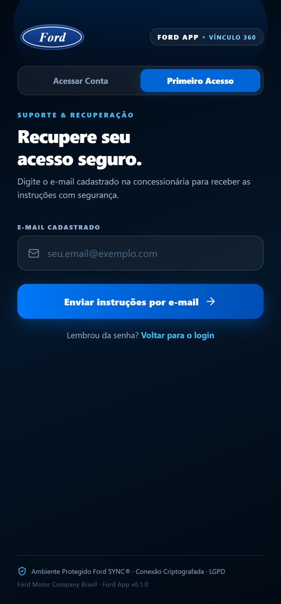
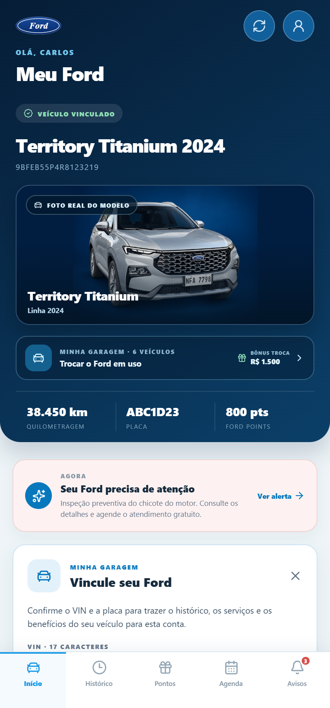
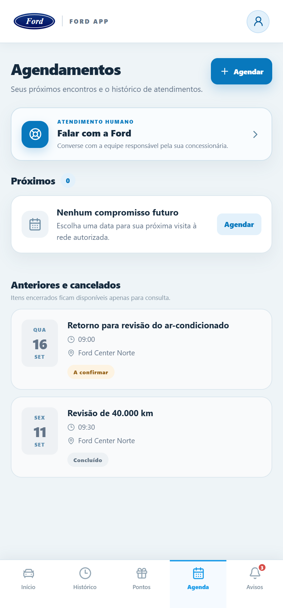
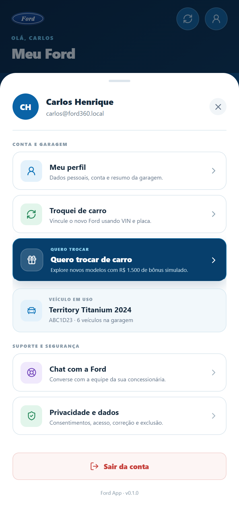
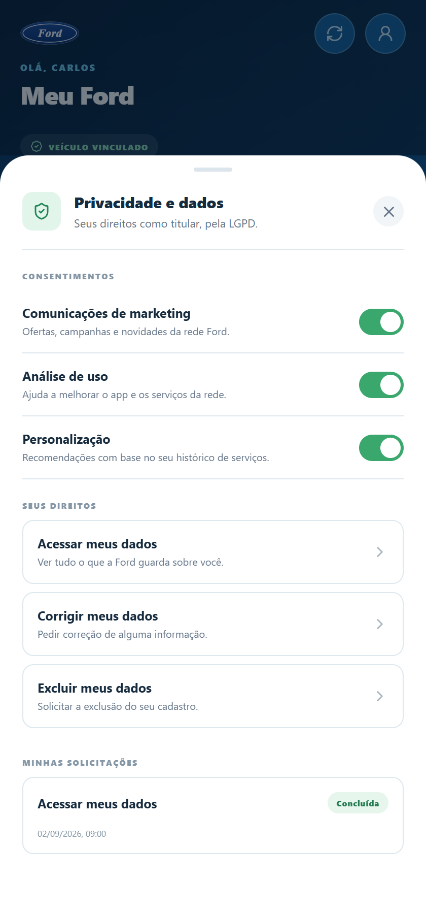

# Catálogo Visual de Telas — Ford Vínculo 360

Este documento apresenta todas as telas do **Ford App (aplicativo do proprietário)** e do **Painel da Rede Ford (concessionária e montadora)** capturadas em alta definição diretamente do ambiente local em execução.

---

## Índice

- [Parte 1: Aplicativo do Proprietário (Ford App)](#parte-1-aplicativo-do-proprietário-ford-app)
  - [01. Login e Acesso Seguro](#01-login-e-acesso-seguro)
  - [02. Auto-Cadastro de Proprietário e Veículo](#02-auto-cadastro-de-proprietário-e-veículo)
  - [03. Recuperação de Senha & Primeiro Acesso](#03-recuperação-de-senha--primeiro-acesso)
  - [04. Home — Identidade Digital do Veículo & VIN](#04-home--identidade-digital-do-veículo--vin)
  - [05. Home — Próxima Manutenção Estimada & Ofertas](#05-home--próxima-manutenção-estimada--ofertas)
  - [06. Minha Garagem — Frota Pessoal & Bônus Troca](#06-minha-garagem--frota-pessoal--bônus-troca)
  - [07. Vincular Novo Veículo à Conta (Claim)](#07-vincular-novo-veículo-à-conta-claim)
  - [08. Ficha Técnica Mecânica do Veículo](#08-ficha-técnica-mecânica-do-veículo)
  - [09. Histórico Vitalício de Revisões e Serviços](#09-histórico-vitalício-de-revisões-e-serviços)
  - [10. Detalhamento de Ordem de Serviço na Rede Ford](#10-detalhamento-de-ordem-de-serviço-na-rede-ford)
  - [11. Ford Pontos — Saldo e Extrato de Fidelidade](#11-ford-pontos--saldo-e-extrato-de-fidelidade)
  - [12. Catálogo de Vouchers e Benefícios Exclusivos](#12-catálogo-de-vouchers-e-benefícios-exclusivos)
  - [13. Meus Agendamentos na Rede Concessionária](#13-meus-agendamentos-na-rede-concessionária)
  - [14. Modal de Novo Agendamento de Serviços](#14-modal-de-novo-agendamento-de-serviços)
  - [15. Central de Notificações, Alertas & Recalls](#15-central-de-notificações-alertas--recalls)
  - [16. Menu da Conta e Suporte ao Cliente](#16-menu-da-conta-e-suporte-ao-cliente)
  - [17. Privacidade, Governança e Direitos LGPD](#17-privacidade-governança-e-direitos-lgpd)
  - [18. Vitrine de Lançamentos & Catálogo de Modelos Ford](#18-vitrine-de-lançamentos--catálogo-de-modelos-ford)
- [Parte 2: Painel Web da Concessionária](#parte-2-painel-web-da-concessionária)
  - [19. Painel Geral da Unidade & Taxa de Retenção](#19-painel-geral-da-unidade--taxa-de-retenção)
  - [20. Desafio 02 — Inteligência Artificial & Risco de Evasão](#20-desafio-02--inteligência-artificial--risco-de-evasão)
  - [21. Base de Clientes com Proteção Cadastral LGPD](#21-base-de-clientes-com-proteção-cadastral-lgpd)
  - [22. Funil Comercial de Recompra de Seminovos](#22-funil-comercial-de-recompra-de-seminovos)
  - [23. Gestão e Disparo de Campanhas de Pós-Venda](#23-gestão-e-disparo-de-campanhas-de-pós-venda)
  - [24. Estoque de Veículos com Histórico Vitalício do VIN](#24-estoque-de-veículos-com-histórico-vitalício-do-vin)

---

## Parte 1: Aplicativo do Proprietário (Ford App)

### 01. Login e Acesso Seguro

- **O que é**: Porta de entrada do cliente Ford ao ecossistema digital do seu automóvel.
- **Funcionalidades**:
  - Autenticação criptografada com e-mail e senha.
  - Alternância rápida para primeiro acesso ou auto-cadastro.
  - Botão de preenchimento rápido para demonstração (`carlos@ford360.local`).
  - Selo de conformidade com ambiente protegido Ford SYNC® e LGPD.

---

### 02. Auto-Cadastro de Proprietário e Veículo

- **O que é**: Permite ao proprietário criar sua conta e associar seu veículo Ford de forma autônoma.
- **Funcionalidades**:
  - Dados pessoais (nome completo, e-mail, telefone de contato).
  - Identificação veicular (VIN/chassi de 17 caracteres, placa, modelo, ano de fabricação/modelo, cor externa).
  - Quilometragem inicial autodeclarada e concessionária de preferência.
  - Termos de consentimento e privacidade.

---

### 03. Recuperação de Senha & Primeiro Acesso

- **O que é**: Fluxo de segurança para redefinição de credenciais ou ativação de convite.
- **Funcionalidades**:
  - Envio de código transacional por e-mail com validade estrita de 30 minutos.
  - Proteção contra tentativas abusivas e invalidação global de sessões anteriores.

---

### 04. Home — Identidade Digital do Veículo & VIN

- **O que é**: Painel principal do proprietário com visualização da identidade do seu Ford.
- **Funcionalidades**:
  - Render estúdio oficial do modelo cadastrado (ex.: Ford Territory Titanium).
  - Identidade única pelo VIN vinculada à base nacional.
  - Selo oficial de veículo com garantia de fábrica ativa.
  - Odômetro atualizado e data estimada da próxima inspeção.
  - Botão de acesso rápido à Minha Garagem.

---

### 05. Home — Próxima Manutenção Estimada & Ofertas

- **O que é**: Seção preditiva que antecipa necessidades de manutenção e ofertas personalizadas.
- **Funcionalidades**:
  - Alerta de quilometragem e intervalo de tempo recomendados para a próxima revisão na rede.
  - Ofertas e campanhas de pós-venda segmentadas de acordo com o modelo.
  - Botão de ação rápida com 1 clique para agendar o serviço na concessionária.

---

### 06. Minha Garagem — Frota Pessoal & Bônus Troca

- **O que é**: Gerenciador multiveicular para proprietários ou famílias que possuem mais de um Ford.
- **Funcionalidades**:
  - Alternância imediata entre veículos cadastrados sem necessidade de logout.
  - Cálculo e exibição do **Bônus Troca Ford**: valor acumulado a cada revisão realizada na rede para utilização como desconto na recompra de um novo Ford.
  - Atalho para o catálogo de novos modelos.

---

### 07. Vincular Novo Veículo à Conta (Claim)

- **O que é**: Formulário para reivindicar a posse de um veículo novo ou usado adquirido.
- **Funcionalidades**:
  - Validação cruzada de VIN e placa junto ao cadastro central Ford.
  - Notificação de transferência caso o veículo possuísse proprietário anterior, mantendo a privacidade e histórico contínuo da máquina.

---

### 08. Ficha Técnica Mecânica do Veículo

- **O que é**: Detalhamento técnico oficial das especificações de engenharia do veículo.
- **Funcionalidades**:
  - Motorização, potência, torque, transmissão, tração e consumo homologado.
  - Prazos e termos da garantia contratual Ford.
  - Concessionária responsável pela entrega técnica original.

---

### 09. Histórico Vitalício de Revisões e Serviços

- **O que é**: Livro de bordo digital e imutável que registra todas as passagens do veículo pela rede autorizada.
- **Funcionalidades**:
  - Linha do tempo cronológica com data, quilometragem, tipo de intervenção e unidade Ford.
  - Preservação do histórico mesmo após a venda do automóvel, valorizando o usado na rede.

---

### 10. Detalhamento de Ordem de Serviço na Rede Ford

- **O que é**: Comprovante digital completo da ordem de serviço executada.
- **Funcionalidades**:
  - Discriminação dos itens revisados (óleo, filtros, fluido, freios, alinhamento).
  - Valor total dos serviços, status de conclusão e assinatura técnica da concessionária.

---

### 11. Ford Pontos — Saldo e Extrato de Fidelidade

- **O que é**: Programa de fidelização e recompensas integrado às passagens na concessionária.
- **Funcionalidades**:
  - Saldo acumulado em pontos a cada real investido em revisões e peças originais.
  - Extrato detalhado de transações (pontos creditados por serviço e pontos debitados em resgates).

---

### 12. Catálogo de Vouchers e Benefícios Exclusivos

- **O que é**: Loja de recompensas onde o proprietário converte seus Ford Pontos em benefícios tangíveis.
- **Funcionalidades**:
  - Resgate de vouchers de desconto em revisões periódicas (ex.: R$ 150, R$ 250).
  - Vouchers para alinhamento/balanceamento, cristalização e acessórios originais.
  - Código do voucher gerado para validação instantânea na oficina.

---

### 13. Meus Agendamentos na Rede Concessionária

- **O que é**: Central de agendamentos de oficina do proprietário.
- **Funcionalidades**:
  - Visualização de compromissos futuros (data, hora, serviço e unidade).
  - Status em tempo real (A Confirmar, Confirmado, Concluído).
  - Opção de cancelamento ou reagendamento sem fricção.

---

### 14. Modal de Novo Agendamento de Serviços

- **O que é**: Fluxo simplificado de agendamento de oficina direto pelo smartphone.
- **Funcionalidades**:
  - Seleção da concessionária mais conveniente.
  - Tipo de atendimento: Revisão periódica, Diagnóstico, Pneus/alinhamento ou Recall.
  - Grade com dias úteis e horários disponíveis em tempo real com controle de capacidade da oficina.

---

### 15. Central de Notificações, Alertas & Recalls

- **O que é**: Notificações oficiais e chamados urgentes de segurança do veículo.
- **Funcionalidades**:
  - Convocação de Recalls oficiais com severidade, descrição técnica e agendamento prioritário gratuito.
  - Alertas de proximidade de revisão e aviso de novos vouchers liberados.

---

### 16. Menu da Conta e Suporte ao Cliente

- **O que é**: Central de configurações do titular e canal direto com a rede.
- **Funcionalidades**:
  - Acesso ao perfil cadastral.
  - Canal de Suporte e chamados diretamente com a equipe técnica da concessionária.
  - Encerramento seguro de sessão e identificação da versão do aplicativo.

---

### 17. Privacidade, Governança e Direitos LGPD

- **O que é**: Gestão de transparência, privacidade e proteção de dados do titular.
- **Funcionalidades**:
  - Gestão de consentimentos granulares e revogáveis (marketing, análise de uso, personalização preditiva).
  - Solicitação formal de dados (acesso completo, retificação ou exclusão de cadastro).

---

### 18. Vitrine de Lançamentos & Catálogo de Modelos Ford

- **O que é**: Showroom digital integrado que apresenta lançamentos da marca ao proprietário ativo.
- **Funcionalidades**:
  - Ficha dos modelos (Ranger, Maverick, Bronco Sport, Territory, F-150, Mustang Mach-E).
  - Botão "Tenho interesse" que conecta o cliente ao time de vendas da concessionária aproveitando o bônus troca acumulado.

---

## Parte 2: Painel Web da Concessionária

### 19. Painel Geral da Unidade & Taxa de Retenção

- **O que é**: Dashboard operacional e gerencial da concessionária autorizada.
- **Funcionalidades**:
  - Retenção da carteira em 12 meses.
  - Veículos ativos na base, ordens de serviço em atendimento e agenda do dia.
  - Segmentação visual da carteira em 4 faixas: Ativo, Atenção, Em Risco e Perdido.

---

### 20. Desafio 02 — Inteligência Artificial & Risco de Evasão

- **O que é**: Módulo de Machine Learning que antecipa o afastamento de clientes antes que eles deixem a marca.
- **Funcionalidades**:
  - Modelo preditivo treinado (`churn-risk-pilot-v1`) calculando a probabilidade de evasão em percentual.
  - Fatores analisados: tempo sem revisão, quilometragem, histórico de serviços e utilização de vouchers.
  - Ação recomendada automática (ex.: disparo de voucher de revisão em 1 clique).

---

### 21. Base de Clientes com Proteção Cadastral LGPD

- **O que é**: Cadastro centralizado de clientes e veículos da concessionária.
- **Funcionalidades**:
  - Mascaramento automático de CPF nas listagens gerais para conformidade LGPD.
  - Ficha completa do cliente com histórico de compras, status da garantia de cada veículo e trilha de auditoria.

---

### 22. Funil Comercial de Recompra de Seminovos

- **O que é**: Funil de vendas que transforma o pós-venda em oportunidade de recompra.
- **Funcionalidades**:
  - Algoritmo que identifica momento ideal de troca (veículos entre 3 e 5 anos com manutenção na rede).
  - Estimativa de valor de usados e conversão de leads para os consultores de seminovos.

---

### 23. Gestão e Disparo de Campanhas de Pós-Venda

- **O que é**: Criação e acompanhamento de campanhas transacionais por e-mail, SMS e push.
- **Funcionalidades**:
  - Campanhas por modelo, tempo de revisão ou recall ativo.
  - Fila de mensageria com templates institucionais Ford e rastreamento de entregas.

---

### 24. Estoque de Veículos com Histórico Vitalício do VIN

- **O que é**: Gestão de veículos novos e seminovos da concessionária.
- **Funcionalidades**:
  - Cada veículo usado retomado na troca carrega seu histórico de manutenção no VIN como argumento de venda.
  - Registro de venda com cadastro do novo cliente e início automático do novo vínculo.
