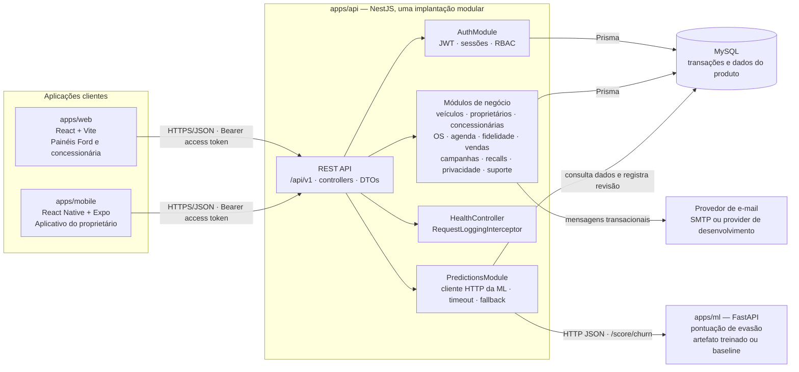
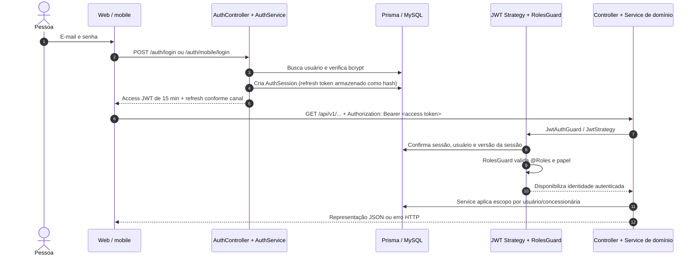

# Sprint 3 — Arquitetura orientada a serviços

**Projeto:** Ford Vínculo 360  
**Escopo:** arquitetura executada no repositório, fronteiras de serviço, comunicação e segurança da API, estilo REST, documentação e evidências de teste.  
**Base da análise:** inspeção estática do código e documentação; build e testes locais registrados em 27/09/2026.

## Parecer

A arquitetura está **adequada para um piloto acadêmico e para a rubrica de arquitetura orientada a serviços**, desde que seja descrita com precisão: o backend de negócio é um **monólito modular NestJS**, com o serviço de previsões **FastAPI separado e chamado por HTTP**. Web e mobile são aplicações clientes independentes. MySQL é o armazenamento transacional comum, acessado pela API via Prisma.

O sistema não está dividido em microserviços por domínio: módulos como veículos, vendas, fidelidade e agendamentos são módulos NestJS dentro do mesmo processo e implantação da API. Essa escolha mantém baixo o custo operacional e preserva separação de responsabilidades no código. A fronteira independente de ML demonstra comunicação entre serviços; não há evidência de fila/broker entre API e ML.

| Critério da entrega | Situação observada | Para encerrar a rubrica |
|---|---|---|
| Componentes e responsabilidades | Implementados e agora representados neste documento. | Apresentar o diagrama de componentes e mostrar os módulos no código. |
| Comunicação e autenticação | REST/JSON, JWT, sessões persistidas e chamada HTTP à ML estão implementados. | Explicar o fluxo do navegador/mobile e a chamada síncrona à ML; documentar implantação e proteção da rede entre API e ML. |
| RBAC e JWT | Implementados com guardas por papel e escopo por usuário/concessionária. | Apresentar a matriz de papéis e evidência de acesso permitido/negado por papel e unidade. |
| REST nível 2 e status HTTP | Recursos e verbos HTTP estão presentes; login, refresh, logout e comandos de autenticação declaram `200`; criação continua `201`. | Registrar os códigos dos comandos de negócio individualmente no OpenAPI; POST do NestJS retorna `201` por padrão. |
| Testes | Build API/web, typecheck mobile e testes mobile executados localmente; smoke tests integrados dependem de API/banco locais. | Guardar evidências dos smoke tests preparados e ampliar testes de autorização/contrato. |
| Swagger, erros e README | Bearer e tags estão associados às rotas protegidas; matriz de acesso e fronteiras estão descritas aqui. | Completar schemas/respostas de cada endpoint e decidir se será criado envelope/filtro global de erros. |

## Diagrama de componentes implantados



### Responsabilidades por fronteira

- **Web e mobile:** apresentam os fluxos de negócio e consomem a API; não acessam MySQL nem chamam diretamente o serviço FastAPI. O cliente web centraliza chamadas e refresh em `apps/web/src/lib/api.ts`; o mobile cria a URL configurável em `apps/mobile/src/session.ts`.
- **API NestJS:** autentica, aplica regras e escopos de acesso, valida entradas, grava auditoria e coordena as operações. O bootstrap em `apps/api/src/main.ts` aplica o prefixo `/api/v1`, CORS, validação global e Swagger.
- **Módulos de domínio NestJS:** cada área mantém controller, service e module próprios. O registro dos módulos está em `apps/api/src/app.module.ts`; exemplos: `vehicles`, `ownerships`, `service-orders`, `bookings`, `loyalty`, `sales`, `privacy` e `support`.
- **Prisma/MySQL:** `apps/api/src/prisma/prisma.service.ts` é o acesso do backend ao banco. O schema em `apps/api/prisma/schema.prisma` concentra entidades e relações; transações são iniciadas pelos serviços da API.
- **FastAPI de ML:** `apps/ml/app/main.py` expõe `/health`, `/score/churn` e `/score/churn/batch`. Recebe as quatro variáveis numéricas do modelo e devolve probabilidade, classificação, motivos, fonte e versão do modelo. Não mantém o cadastro operacional.
- **Mensageria:** o `MessagingModule` encapsula providers de console e SMTP. Convites, recuperação de senha e notificações podem passar por essa fronteira; ela não altera o desenho transacional principal.

## Comunicação entre API, persistência e serviço de ML

O tráfego de produto usa recursos HTTP sob `/api/v1`. A API faz consultas e gravações transacionais em MySQL pelo Prisma. A integração com ML é uma chamada HTTP síncrona JSON de dentro do `PredictionsService`; para uma previsão individual o timeout é de 3 segundos, e para lote é de 5 segundos. Se a chamada falhar ou retornar uma resposta inválida, a API calcula um resultado heurístico e identifica a fonte como fallback. Assim, uma indisponibilidade de ML não interrompe as telas, mas a origem do resultado precisa continuar visível para quem interpreta o score.

O fluxo está implementado em `apps/api/src/predictions/predictions.service.ts` e `apps/ml/app/main.py`. O endereço é configurável com `ML_SERVICE_URL`; na ausência de configuração, o backend usa `http://127.0.0.1:8000`. O modelo treinado é carregado do artefato local `apps/ml/artifacts/churn_model.joblib`; quando ele falta, a API FastAPI declara que está usando baseline heurística.

```mermaid
sequenceDiagram
  autonumber
  actor Pessoa as Usuário interno
  participant Cliente as Web ou mobile
  participant API as NestJS /api/v1
  participant DB as MySQL via Prisma
  participant ML as FastAPI /score/churn

  Pessoa->>Cliente: Consulta risco de um VIN
  Cliente->>API: GET /predictions/vehicles/{vin}/churn + Bearer JWT
  API->>API: JwtAuthGuard valida identidade; RolesGuard valida papel
  API->>DB: Confere veículo, unidade e serviços concluídos
  DB-->>API: Histórico e variáveis do modelo
  API->>ML: POST /score/churn (JSON; timeout de 3 s)
  alt Serviço e modelo disponíveis
    ML-->>API: probability, classification, reasons, model_version, source
  else Falha, timeout ou resposta inválida
    API->>API: Calcula fallback heurístico e marca a fonte
  end
  API-->>Cliente: JSON com score, classificação, razões e proveniência
```

**Ponto para implantação:** a comunicação API→ML está sem autenticação de serviço própria no código examinado. No piloto local, a URL loopback limita a exposição; ao separar processos ou hospedar os serviços, mantenha ML em rede privada e limite o acesso ao chamador da API. Se a fronteira atravessar redes não confiáveis, adicionar autenticação serviço-a-serviço e TLS. Não publique o endpoint FastAPI diretamente para os clientes.

## Autenticação, autorização e escopo dos dados

O login valida a senha com bcrypt, verifica usuário ativo, perfil aceito e bloqueio temporário. A API emite access token JWT de **15 minutos** e cria uma sessão persistida. O refresh token é rotacionado e a sessão permite logout e revogação por dispositivo. As rotas do navegador usam cookie `HttpOnly` para refresh; o fluxo `/auth/mobile/*` entrega o refresh token ao cliente nativo, que o guarda no armazenamento seguro da plataforma. Esses fluxos ficam em `apps/api/src/auth/auth.controller.ts` e `auth.service.ts`; a persistência das sessões está ligada à tabela `AuthSession` do Prisma.

Em cada requisição autenticada, `JwtAuthGuard` delega à estratégia Passport em `apps/api/src/auth/jwt.strategy.ts`. Ela extrai o Bearer token, valida assinatura e expiração, consulta a sessão e rejeita sessão revogada/expirada, usuário inativo ou `sessionVersion` divergente. `RolesGuard` lê os metadados definidos por `@Roles(...)` e bloqueia quem não tiver um papel permitido.

| Papel | Escopo pretendido e aplicado no código |
|---|---|
| `FORD_ADMIN` | Visão e operações da rede; alguns serviços removem filtro de concessionária para esse papel. |
| `DEALERSHIP_MANAGER` | Gestão operacional da concessionária vinculada ao perfil. |
| `DEALERSHIP_AGENT` | Operações da equipe da concessionária, com permissões administrativas mais restritas. |
| `CUSTOMER` | Próprio perfil, veículos com vínculo ativo e recursos pessoais. |

O papel no guard é complementado por filtros nos serviços para limitar dados à unidade ou ao proprietário. `apps/api/src/common/access-scope.ts` centraliza `vehicleScope` e `customerScope`; `VehiclesService`, por exemplo, aplica filtro pelo vínculo ativo do cliente ou pela concessionária. A identidade do ator é injetada com `CurrentUser`, e o código usa o `dealershipId` do token/usuário autenticado em vez de confiar cegamente no valor enviado pelo cliente.

**Evidência a apresentar:** demonstrar a mesma consulta com cliente, agente de concessionária e administrador Ford; incluir um VIN fora do escopo e mostrar a resposta negada ou não encontrada. O script `scripts/smoke-scheduling.ps1` já declara verificações de isolamento por concessionária. Convém também revisar cada rota sem `@Roles`: o `RolesGuard` deixa passar qualquer usuário autenticado quando não há papéis declarados, então a ausência de metadados precisa ser intencional e coberta por teste.

### Mapa de acesso HTTP

| Tipo de rota | Credencial | Exemplos implementados |
|---|---|---|
| Pública | Sem access token | `GET /api/v1/health`; login, cadastro, recuperação de senha e aceite de convite em `/api/v1/auth`; opções públicas de concessionária/veículo e autocadastro em `/api/v1/ownerships`. |
| Renovação de sessão | Cookie `HttpOnly` no painel; refresh token no corpo nas rotas nativas | `POST /api/v1/auth/refresh` e `/auth/app/refresh` (cookie); `/auth/mobile/refresh` (token nativo). `auth/logout`, `app/logout` e `mobile/logout` revogam a credencial do canal; `auth/logout-all` exige Bearer. |
| Protegida | `Authorization: Bearer <access-token>` | `/api/v1/auth/me`, `/vehicles`, `/bookings`, `/service-orders`, `/predictions` e operações autenticadas de `/ownerships`. |

No Swagger, `@ApiBearerAuth()` marca as operações protegidas e `@ApiTags()` agrupa os recursos. Os controllers inteiramente protegidos declaram segurança no nível da classe; controllers com rotas públicas e privadas, como `ownerships` e `auth`, declaram a segurança por operação. O esquema Bearer sozinho registra o mecanismo, mas não substitui esses metadados de operação.



## REST e códigos HTTP

A API mostra as características centrais do nível 2 do modelo de Richardson: URLs nomeiam recursos e as operações usam `GET`, `POST`, `PATCH`, `PUT` e `DELETE`. Exemplos: `GET /vehicles/:vin`, `POST /vehicles`, `GET /bookings` e `PATCH /service-orders/:id`. O prefixo `/api/v1` identifica a versão. Rotas como `/auth/login`, `/ownerships/transfer`, `/predictions/churn` e `/messaging/:id/retry` expressam comandos de negócio por `POST`, o que é aceitável para operações sem semântica simples de CRUD, mas reduz a uniformidade do estilo de recursos.

O projeto usa exceções HTTP do NestJS nos serviços (`BadRequestException`, `UnauthorizedException`, `ForbiddenException`, `NotFoundException` e `ConflictException`) e converte erros conhecidos de VIN duplicado em `409 Conflict`. A validação global em `main.ts` usa `ValidationPipe({ whitelist: true, transform: true })`; DTOs definem a validação de entrada. Os códigos usuais ficam coerentes com `400`, `401`, `403`, `404` e `409`.

| Operação | Status de sucesso observado |
|---|---|
| `GET` de recurso/health | `200 OK`; health informa `ok`, `degraded` ou `unhealthy` no JSON. |
| Login, refresh, logout, recuperação de senha e aceite de convite | `200 OK`, definido com `@HttpCode(HttpStatus.OK)`. |
| Cadastro e criação por `POST` | `201 Created`; é o padrão do NestJS quando não há `@HttpCode` específico. |
| Atualização por `PATCH`/`PUT` | `200 OK`. |
| Erros de entrada/autorização/recurso/conflito | `400`, `401`, `403`, `404` e `409`, conforme exceção lançada. |

As operações de comando `POST` sem criação de recurso também herdam `201` se não definirem `@HttpCode`; vale decidir e anotar o status por operação (por exemplo, `200` para uma ação concluída ou `202` para processamento assíncrono). O Swagger ainda não documenta todos os códigos de resposta.

O endpoint `GET /api/v1/health` agrega banco e ML. Ele escreve `ok`, `degraded` ou `unhealthy` no corpo JSON, mas retorna o status HTTP normal do `GET` mesmo quando o banco está indisponível. Para orquestração e monitores, separar liveness e readiness e devolver `503 Service Unavailable` quando a API não puder atender requisições é uma melhoria recomendada. O health atual está em `apps/api/src/health.controller.ts`.

## Swagger, erros e observabilidade

O Swagger é montado em `apps/api/src/main.ts` em `/docs`, com título, descrição, versão e esquema Bearer. Os controllers protegidos agora têm tags e metadados de segurança associados às operações autenticadas. DTOs possuem algumas propriedades documentadas, mas ainda não há cobertura uniforme de modelos e respostas (`200`/`201`/`400`/`401`/`403`/`404`/`409`) em todas as rotas. A UI permite selecionar Bearer; o contrato OpenAPI pode ser mais completo sem bloquear a entrega dos diagramas e da arquitetura.

O NestJS aplica seu tratamento padrão para exceções; não foi encontrado filtro global próprio nem envelope de erro comum. A forma padrão tem `statusCode`, `message` e `error`; mensagens de validação podem ser uma lista. O `RequestLoggingInterceptor`, registrado globalmente em `apps/api/src/app.module.ts`, emite `x-request-id` validado e registra método, rota sem query string, status e duração, incluindo exceções. Alguns erros Prisma são traduzidos localmente, como duplicidade de VIN em `VehiclesService`; não há mapeamento central de erros de persistência.

**Ações recomendadas para a documentação técnica:**

1. Acrescentar descrição, schema e respostas de sucesso/erro às operações ainda sem contrato completo no Swagger; anotar status específico para cada comando `POST`.
2. Se consumidores precisarem de um contrato de erro uniforme, implementar filtro global e mapear erros de persistência sem expor detalhes internos.
3. Decidir quais endpoints do Swagger e health ficam acessíveis fora do ambiente local e incluir a regra na configuração de implantação.

## Evidências de testes e README

Os scripts existentes são testes de integração do tipo smoke: chamam uma API já em execução e esperam ambiente e contas locais/dados semeados. `readme.md` explica como subir os serviços, mostra `/api/v1/health` e `/docs`, apresenta contas de demonstração e lista comandos de verificação.

| Comando/documento | Cenário descrito pelo artefato |
|---|---|
| `pnpm test:smoke` → `scripts/smoke-api.ps1` | Health e leitura de veículos, ordens, agenda, recalls, leads e auditoria. |
| `pnpm test:scheduling` → `scripts/smoke-scheduling.ps1` | Capacidade, horário de funcionamento e isolamento de concessionária; confere falhas `400` e `403`. |
| `pnpm test:support-access` → `scripts/smoke-support-access.ps1` | Convite, abertura/atendimento de chamado, recuperação de senha e revogação de sessões. |
| `pnpm test:refresh-sessions` → `scripts/smoke-refresh-sessions.ps1` | Cookie, rotação, sessões em dois dispositivos, revogação individual e logout. |
| `pnpm test:messaging` → `scripts/smoke-messaging.ps1` | Fila de e-mail, entrega e eventos de rastreamento. |
| `pnpm test:regression` → `scripts/regression.test.cjs` | Oito cenários de regressão para autorização, sessões, privacidade, campanhas, vouchers e OS; escreve fixtures no banco e limpa apenas as que cria. |
| `node --test scripts/pilot-import.test.cjs` | Um cenário de integração para validação, escopo e idempotência da importação; usa banco e API. |
| `node --test scripts/campaign-dispatch.test.cjs` | Um cenário de integração de despacho de campanha e atribuição de serviço; pode enviar e-mail se SMTP estiver habilitado. |

O pacote da API declara `@nestjs/testing`, mas não há diretório de testes unitários/e2e dentro de `apps/api/src`, nem script dedicado de teste no `apps/api/package.json`. Os smoke tests demonstram fluxos reais, mas ainda faltam testes automatizados de serviço/guard e de contrato HTTP para todos os perfis. Na revisão de 27/09/2026, `pnpm check` (build API/web e typecheck mobile), `pnpm test:mobile` (13 testes) e `pnpm audit --prod --audit-level high` foram aprovados. Os smoke e testes de integração não foram repetidos nesta revisão: eles chamam os serviços locais, alteram o banco e a configuração local indica SMTP ativo. A evidência histórica de 06/09 está identificada como histórica em `docs/qa-2026-09-06.md`; não equivale a uma nova execução.

## Checklist para a apresentação

- [ ] Explicar em uma frase: “NestJS modular monolith para regras transacionais, com FastAPI isolado para scoring; clientes web/mobile consomem REST versionada”.
- [ ] Exibir o diagrama de componentes e apontar `AppModule`, `PredictionsModule`, `PrismaModule` e os diretórios de módulos de domínio.
- [ ] Demonstrar login e chamada autenticada: access JWT curto, refresh rotativo e sessão revogável.
- [ ] Demonstrar RBAC mais escopo de dados: usuário, papel e concessionária determinam o conjunto retornado.
- [ ] Mostrar a rota de previsão e explicar timeout, fonte/versão do resultado e fallback.
- [ ] Mostrar exemplos de `GET`, `POST`, `PATCH` e a tabela de status esperados para sucesso e erro.
- [x] Completar metadados de tags e Bearer nas rotas protegidas do OpenAPI.
- [ ] Abrir `/docs`, conferir visualmente os cadeados e capturar uma evidência da UI.
- [ ] Executar os cinco smoke tests e os três scripts de integração em ambiente preparado, com banco descartável e SMTP desabilitado/sandbox; guardar saída, data, commit e configuração usada.
- [x] Atualizar o README para apontar a documentação detalhada de arquitetura e segurança.

## Plano curto para encerrar as lacunas

1. **Para evidência repetível:** abrir `/docs` e capturar a UI com Bearer; executar smoke e integração em ambiente isolado com SMTP sandbox/desligado e guardar os logs.
2. **Para robustez da entrega:** aumentar os testes de autorização por papel e isolamento multi-concessionária; adicionar testes de contrato para `/api/v1` e para a resposta do serviço ML; documentar o contrato de scoring e o fallback.
3. **Antes de hospedar fora do piloto:** manter ML em rede privada, restringir acesso API→ML, configurar TLS e segredos fora do repositório, configurar readiness/liveness e alinhar logs/alertas à implantação real.

**Conclusão:** a entrega de arquitetura está pronta para apresentação da Sprint 3: descreve o monólito modular, a fronteira FastAPI, a comunicação, os diagramas, os fluxos de JWT/RBAC, o mapa de credenciais, os status HTTP e o parecer sobre o escopo. O Bearer agora aparece nos metadados OpenAPI das rotas protegidas. Para comprovar a execução integrada desta revisão, ainda faltam logs novos de smoke/integration em ambiente isolado; isso é uma lacuna de evidência, não uma lacuna no desenho. Para produção, ficam as melhorias de prontidão operacional e cobertura completa de schemas/respostas no OpenAPI.

## Situação de mobile e inteligência artificial

- **Mobile:** aplicativo Expo e fluxos de sessão existem; refresh token é armazenado com `expo-secure-store`, enquanto access token fica em memória. Testes de sessão/contrato e typecheck cobrem partes do cliente, mas não foi encontrado APK final. O perfil `preview` usa endereço local de emulador e `EXPO_PUBLIC_API_URL` de produção precisa ser configurada antes de gerar/distribuir um build instalável.
- **IA/ML:** serviço FastAPI, pipeline de treino e endpoint de scoring existem. `apps/ml/artifacts/metrics.json` registra seleção de regressão logística por ROC-AUC: 0,7924 contra 0,7536 da floresta aleatória, em holdout cronológico de 240 registros sintéticos (960 de treino). É resultado experimental, não validação com dados reais; documentar a natureza sintética, explicar métricas e testar viés/deriva antes de uso operacional.
- **Escopo desta entrega:** os pacotes preparados aqui são arquitetura e cibersegurança. Mobile ainda precisa de build/dispositivo como evidência; ML precisa de validação dos dados e métricas como evidência acadêmica.
