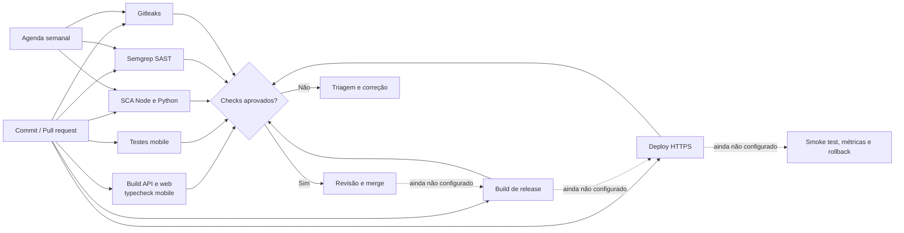
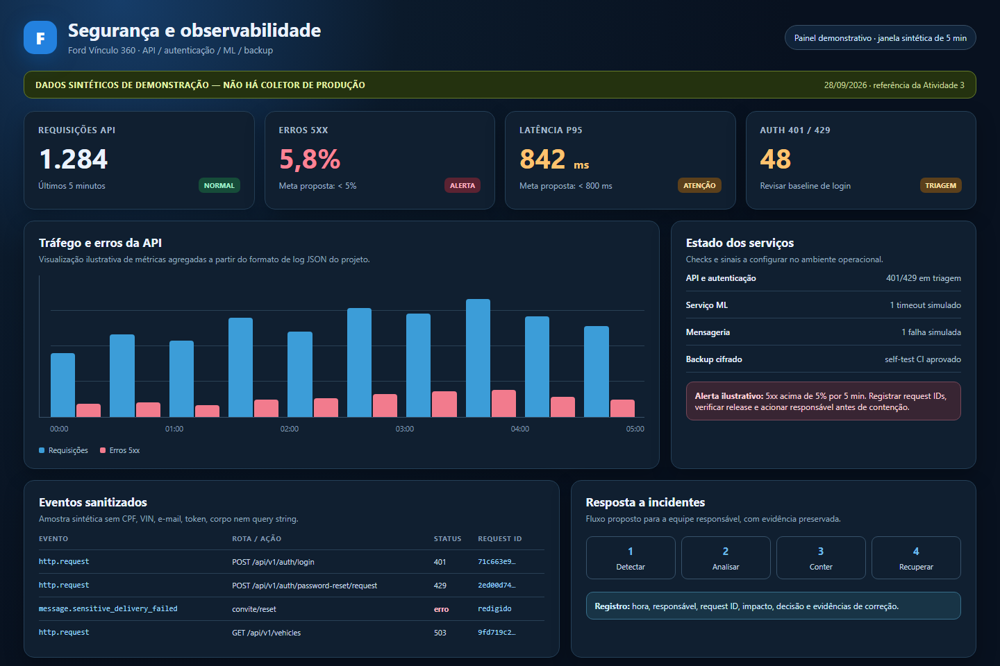
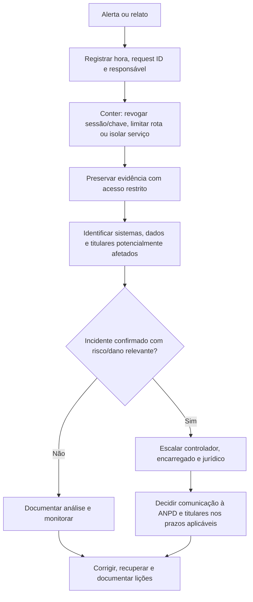

# Sprint 3 — Cibersegurança e privacidade

**Projeto:** Ford Vínculo 360  
**Revisão:** 28/09/2026
**Escopo:** código e artefatos versionados neste workspace. Esta entrega não é pentest, certificação, parecer jurídico nem evidência de um ambiente de produção.

## Parecer executivo

O projeto tem controles de autenticação, sessão, autorização, validação, auditoria, proteção de API e automação DevSecOps. Esta revisão também corrige falhas de autorização entre concessionárias: ordens de serviço consultam o escopo do veículo, leads são listados e alterados apenas pela unidade autorizada, e uma troca só encerra a titularidade ativa do cliente da venda. Agentes não podem emitir pontos manualmente. No mobile, o perfil de produção exige endpoint HTTPS explícito e bloqueia o envio de credenciais se a configuração estiver ausente ou insegura. Links sensíveis de convite/reset também não são persistidos na fila de e-mail, e os logs HTTP não incluem payload, query, cookie ou identificadores pessoais.

**Estado da entrega:** código e relatório publicados em main; o CI de segurança mais recente conferido passou em 28/09/2026 na execução [36368560969](https://github.com/vinycius11dev/ford-vinculo-360/actions/runs/36368560969), commit 6e8a418. O repositório está público e acessível sem convite. A branch main agora exige os quatro jobs de segurança, inclusive para administradores, e bloqueia force push e exclusão; ainda faltam deploy, evidência de dashboard/alertas, restore real, cofre/cópia externa e decisões do controlador sobre LGPD. A entrega acadêmica está documentada; não há declaração de prontidão de produção.

| Frente | Estado | Evidência e limite |
|---|---|---|
| DevSecOps | CI completo aprovado | Execução [36349554276](https://github.com/vinycius11dev/ford-vinculo-360/actions/runs/36349554276), commit `e326b7b`. Alertas de vulnerabilidade e Dependabot ativos; não há CD/deploy. |
| API e identidade | Controles implementados | JWT curto, refresh rotativo, hash de refresh/reset/convite, RBAC/escopo, limites, CORS, Helmet, validação de segredo/configuração e logs sem dados de conteúdo. |
| Mensagens com credenciais | Corrigido para novos envios | Tokens não entram na fila nem em eventos; respostas administrativas são redigidas; falha invalida a credencial. Dados antigos ainda exigem saneamento controlado. |
| Mobile | Controles implementados; publicação pendente | Refresh token em SecureStore e token de acesso em memória. O perfil EAS de produção exige EXPO_PUBLIC_API_URL HTTPS e recusa requests sem isso; falta cadastrar o endpoint real e validar em dispositivo. |
| Observabilidade | Plano e formato prontos; operação pendente | Logs JSON estruturados no processo. Não há coletor, dashboard, alerta configurado, retenção centralizada ou simulado comprovado. |
| LGPD | Controles e checklist documentados; governança pendente | Bases legais, prazos, contratos, RIPD quando aplicável e decisões do controlador precisam de validação formal. |
| Backup local | Ferramenta cifrada entregue; ensaio pendente | AES-256-GCM, frase secreta fora do disco e restauração isolada estão implementados. Nenhuma conexão, dump ou restore real foi executado; backups antigos em claro permanecem intactos. |
| IoT/MQTT e IaC | Fora do escopo implementado | Nenhum broker, cliente MQTT, container ou IaC foi encontrado. Requisitos futuros estão descritos abaixo. |


## Rastreabilidade das quatro atividades do enunciado

| Atividade e peso | Evidências desta entrega | Estado e itens operacionais pendentes |
|---|---|---|
| 1. Pipeline DevSecOps Integrado (3,0) | Workflow com build/typecheck, testes de segurança, SCA Node/Python, Semgrep e Gitleaks; execução [36368560969](https://github.com/vinycius11dev/ford-vinculo-360/actions/runs/36368560969). | CI e scanners estão entregues. A branch pública exige os quatro checks de segurança; deploy e rollback dependem do ambiente de execução. |
| 2. Segurança em Código e Infraestrutura (2,5) | Autenticação e escopo API, correções de autorização, armazenamento seguro e política HTTPS mobile, criptografia local de backup, exemplos técnicos e testes. | Não existe integração MQTT/IaC no projeto. O endpoint HTTPS real do EAS, saneamento histórico e ensaio operacional continuam dependentes do responsável pelo ambiente. |
| 3. Observabilidade, Monitoramento e Resposta (2,0) | Logs JSON sem payload/segredos, indicadores e limites propostos, painel a configurar e fluxo documentado de resposta a incidentes. | Não há coletor, dashboard, alertas calibrados nem simulado de incidente em ambiente real; não apresentamos telas ou logs sintéticos como evidência de produção. |
| 4. Compliance, Riscos e Segurança Contínua (2,5) | STRIDE, referências OWASP, checklist LGPD, análise de riscos, workflow semanal, procedimento seguro de backup e saneamento. | Conformidade formal, bases legais/retenção, aprovação do controlador, revisão independente e comprovantes operacionais precisam ser fornecidos pela organização. |

O relatório separa controles implementados, evidências verificáveis e requisitos que dependem de ambiente/decisão externa. A conclusão descreve prontidão para avaliação acadêmica do trabalho versionado; não declara certificação nem prontidão de produção.

## Atividade 1 (3,0) - Pipeline DevSecOps Integrado



O workflow está definido para push, pull_request, execução manual e agenda semanal. Permissões do workflow são limitadas a leitura; actions estão fixadas por SHA. O repositório está público, e as atualizações semanais do Dependabot estão configuradas. Em 28/09/2026, a branch main foi protegida com os quatro jobs do workflow como checks obrigatórios, histórico linear, bloqueio de force push e exclusão, inclusive para administradores. A regra não exige aprovação de outra pessoa. Não há CD/deploy, verificação pós-deploy nem rollback configurados.

| Verificação | Configuração atual | O que comprova / limite |
|---|---|---|
| Build e tipos | `pnpm check` | Build API/web e typecheck mobile; não é teste dinâmico de segurança. |
| Testes API/mobile/backup | Testes de autorização API, transporte TLS mobile, contratos/sessão e self-test AES-GCM com fixture sintética | Não usam banco real; não substituem testes em aparelho nem a matriz BOLA/BFLA integral. |
| SCA Node | `pnpm audit --audit-level high` | Passou na execução final [36349554276](https://github.com/vinycius11dev/ford-vinculo-360/actions/runs/36349554276); inclui dependências de produção e desenvolvimento e varia com o advisory registry. |
| SCA Python | pip-audit audita apps/ml/requirements.txt e apps/ml/requirements-training.txt no CI. | O ambiente de treino usa versões fixadas no segundo arquivo; a execução 36368560969 passou. |
| SAST | Semgrep CLI 1.178.0, `semgrep scan --config p/default --error --metrics=off --oss-only` | Passou na execução final, sem findings bloqueadores. |
| Segredos | Gitleaks 8.30.1 com checksum SHA-256 e histórico completo | Passou na execução final. Uma exceção exata documenta o texto público dos parâmetros scrypt no manifesto; não é credencial. |
| Dependabot | `.github/dependabot.yml` | Alertas e correções automáticas ativos; atualizações semanais de GitHub Actions, npm e pip com cooldown de sete dias. |
| IaC/container | Não configurado | Não há IaC/container neste escopo; adicionar scanner correspondente se esses artefatos forem introduzidos. |
| Deploy e rollback | Não configurados | Escolher ambiente, artefato, aprovação, smoke test, estratégia de rollback e gestão de segredos. |

### Portão de release recomendado

1. Build e todos os scanners verdes; findings aceitos devem ter responsável, justificativa e prazo.
2. Pull request revisado por outra pessoa; checks obrigatórios e proteção da branch no GitHub.
3. Segredos injetados pelo ambiente, migração revisada, backup cifrado e restauração comprovada.
4. Release para homologação, smoke test de autenticação/autorização e validação de logs/alertas.
5. Deploy gradual com health check; reverter release se falhar autenticação, disponibilidade ou integridade dos dados.

## Atividade 2 (2,5) - Segurança em Código e Infraestrutura

| Controle | Implementação/evidência | Limite ou próxima ação |
|---|---|---|
| Senha e sessão | bcrypt; access JWT de 15 min; refresh aleatório rotativo, guardado por hash SHA-256; sessão, expiração, revogação e `sessionVersion` verificadas | MFA e detecção de credencial comprometida não demonstrados. |
| Reset e convite | Hash no banco, expiração curta e invalidação de credenciais anteriores | Envio novo é síncrono; se falhar, token é invalidado. Em desenvolvimento, token de teste só aparece com flag explícita, sem SMTP e bind local. |
| Outbox de e-mail | `sendSensitive()` persiste payload redigido; conteúdo vai ao provedor apenas em memória; API omite payload/detalhes; reenvio de credenciais bloqueado | Linhas históricas enviadas/falhas e backups podem conter links antigos; requer saneamento/rotação antes de produção. |
| Logs de e-mail | Provedor console/SMTP não registra destinatário, assunto ou corpo; erros persistidos são mensagens genéricas | Logs do provedor externo têm política própria e precisam de retenção/acesso contratados. |
| HTTP | Helmet; CORS por origem exata; `x-request-id`; middleware registra rota/status/duração após a resposta | `/docs` desligado em produção; rever acesso a `/health` e arquivos públicos na topologia final. |
| Configuração | `NODE_ENV` explícito; produção exige CORS HTTPS, `PUBLIC_API_ORIGIN` HTTPS e `JWT_SECRET` com ao menos 32 bytes; bind local em desenvolvimento; cookies `Secure` fora de desenvolvimento | Guardar/rotacionar segredos no gerenciador do ambiente; `.env.example` contém apenas valores demonstrativos locais. |
| Throttling e lockout | Global 120/min; limites menores nas rotas de autenticação; upload 10/min e 5 MB; bloqueio após falhas repetidas | Atualização do lockout agora é atômica no MySQL; falta teste concorrente em banco efêmero. Throttling permanece em memória e por instância. |
| Upload | Aceita JPG/PNG/WebP; tamanho máximo 5 MB; assinatura binária conferida contra MIME declarado; nome aleatório | Completar varredura de malware e política de retenção se uploads entrarem em produção. |
| Autorização | Guards JWT, papel e escopo; OS limita VIN ao escopo do ator, lead é isolado por concessionária e troca verifica titularidade do comprador | 6 testes negativos de API passam localmente; ampliar BOLA/BFLA para todas as rotas em banco efêmero. |
| Mobile | Refresh em expo-secure-store; access token em memória; perfil production exige HTTPS e bloqueia requests antes de enviar credenciais | 3 testes de transporte passam localmente; configurar EXPO_PUBLIC_API_URL HTTPS no EAS, assinar/publicar e validar deep links/TLS em dispositivo. |
| Dados em repouso | Hashes de senha/token; backup local cifrado em streaming com AES-256-GCM e diretório com ACL restrita | Cifragem do banco/volume não foi demonstrada. Falta ensaio supervisionado de restore, cofre para frase secreta, cópia externa, retenção e tratamento de dumps antigos em claro. |

### Trechos de código e rastreabilidade

Os trechos abaixo mostram as verificações centrais introduzidas nesta revisão. Os arquivos completos e testes estão versionados no repositório.

**Ordem de serviço: limitar a consulta do VIN ao escopo do usuário** — `apps/api/src/service-orders/service-orders.service.ts`

    const vehicle = await this.prisma.vehicle.findFirst({
      where: { vin: input.vin.toUpperCase(), ...vehicleScope(actor) },
    });

**Troca: encerrar somente a titularidade ativa do cliente da venda** — `apps/api/src/sales/sales.service.ts`

    where: {
      vehicleId: tradeIn.id,
      userId: customer.id,
      status: OwnershipStatus.ACTIVE,
    },

**Mobile: recusar request antes de enviar credenciais quando a URL de produção não é HTTPS** — `apps/mobile/src/session.ts`

    if (apiConfigurationError) throw new Error(apiConfigurationError);

**Backup: cifrar o fluxo SQL com AES-256-GCM antes de gravar em disco** — `scripts/secure-backup.cjs`

    const cipher = createCipheriv('aes-256-gcm', key, nonce, { authTagLength: TAG_LENGTH });

Código publicado em `e326b7b`; a execução [36349554276](https://github.com/vinycius11dev/ford-vinculo-360/actions/runs/36349554276) passou com os checks listados na Atividade 1. Os testes locais API/mobile usam mocks; a revisão não acessou dados reais.

### Registros históricos de mensagens com credenciais

O código antigo podia guardar um link de reset/convite em OutboundMessage.payload e o corpo renderizado em MessageEvent.detail. O novo endpoint redige ambos; filas antigas pendentes são canceladas e redigidas quando o worker as processa. Registros já enviados/falhos e cópias de backup não são apagados automaticamente. Antes de usar dados reais, pare todas as instâncias e workers, faça backup cifrado e restaure-o em banco descartável. Só então, com autorização e janela aprovadas, saneie payloads/eventos dos quatro templates sensíveis e invalide hashes ainda ativos. O procedimento em docs/operations-security.md exige dry-run por padrão, confirmação explícita e registro operacional ligado ao hash do backup. Ele não aplica mudanças nesta entrega nem altera backups antigos.

### IoT/MQTT e infraestrutura futura (requisito da Atividade 2)

Não foi implementado broker/cliente MQTT nem encontrado manifesto de infra/container. Se telemetria entrar no escopo, exigir rede privada, MQTT sobre TLS 1.2+, certificado individual/mTLS, `allow_anonymous=false`, ACL por tópico/dispositivo, rotação/revogação, validação de schema, limite de frequência, timestamp/nonce contra replay e monitoramento de conexão. Não usar VIN/e-mail como tópico identificador. Adicionar verificação de IaC/container (por exemplo, scanner de imagem/configuração) somente quando tais artefatos forem criados. Este baseline é requisito futuro, não controle instalado.

## Atividade 3 (2,0) - Observabilidade, Monitoramento e Resposta

O middleware escreve JSON após cada resposta, incluindo guards/erros HTTP: `event`, `method`, rota registrada (ou `[unmatched]`), `statusCode`, `durationMs` e `requestId`. Não grava corpo, query string, cookies, destinatário ou token. Eventos de domínio continuam registrados no audit log; falhas de mensageria usam tipo de erro, sem conteúdo do provedor. Os exemplos são **sintéticos**, apenas para demonstrar o formato; não são logs coletados em produção.

```json
{"event":"http.request","method":"POST","path":"/api/v1/auth/login","statusCode":200,"durationMs":84,"requestId":"e45de78c-3d2a-4e68-88dc-f691a901d094"}
{"event":"http.request","method":"POST","path":"/api/v1/auth/login","statusCode":401,"durationMs":31,"requestId":"71c663e9-65de-4d85-9fb8-11ab083c7dd7"}
{"event":"http.request","method":"POST","path":"/api/v1/auth/password-reset/request","statusCode":429,"durationMs":2,"requestId":"2ed00d74-5c7d-4b5c-8c8b-2c2403511151"}
{"event":"message.sensitive_delivery_failed","messageId":"msg_example","errorType":"Error"}
{"event":"audit.domain_change","action":"TEAM_INVITATION_CREATE","entityType":"UserInvitation","requestId":"e45de78c-3d2a-4e68-88dc-f691a901d094"}
```

### Print do painel demonstrativo



O [arquivo HTML do painel](cyber-dashboard-demo.html) acompanha o print e mostra o desenho de indicadores, alerta, eventos sanitizados e resposta. Os valores são **sintéticos** e servem à apresentação acadêmica; o painel não recebe telemetria de produção.

| Painel/indicador a configurar | Gatilho inicial proposto | Resposta |
|---|---|---|
| API: 5xx e disponibilidade | 5xx > 5% em 5 min ou health check indisponível | Acionar responsável, comparar release, limitar tráfego/reverter se regressão. |
| Latência API | p95 > 800 ms por 5 min | Separar latência DB/ML, olhar rota e capacidade; ajustar limite depois de baseline real. |
| Abuso/autenticação | 401/429 ou bloqueios acima de 3× baseline por 10 min | Verificar distribuição/rota, preservar request IDs, conter origem sem bloquear clientes legítimos em massa. |
| Autorização | Pico de 403 ou tentativas de acesso cruzado | Revisar audit log e escopo; revogar sessão/chave se confirmado. |
| Mensageria | Falhas consecutivas de e-mail ou fila crescente por 10 min | Validar SMTP, domínio e fila; gerar credencial nova quando a mensagem sensível falhar. |
| Mobile | Crash-free sessions < 99% após release | Pausar rollout e comparar versão/aparelho; rollback se regressão confirmada. |
| ML | Timeout/5xx ou p95 acima do SLO definido para o piloto | Manter ML em rede privada, avaliar fallback e separar falha de API. |
| Backup | Job ausente/falha ou restore fora do RTO | Suspender release de dados reais até obter backup cifrado e restore comprovado. |
| IoT | Sem painel enquanto não houver integração | Antes de entrar no escopo, definir métricas de conexão, certificados, ACL, replay e volume por dispositivo. |

Os limites acima são **proposta**, não estão configurados nem calibrados por tráfego real. O print demonstra o formato do painel; ainda faltam coletor central, retenção, acesso, métricas automáticas e alertas operacionais. Após homologação, substituir a demonstração por captura e logs reais sanitizados. Não incluir e-mail, CPF, VIN completo, token, corpo de mensagem ou query string nos painéis.

### Resposta a incidentes



Operação a preparar: plantonista/substituto, contatos do controlador/encarregado, severidade, canal seguro, preservação de evidências, processo de rotação de credenciais, comunicação, restauração e simulado. A ANPD informa comunicação pelo controlador à Autoridade e aos titulares em até **3 dias úteis** para incidente que possa causar risco ou dano relevante, conforme a Resolução CD/ANPD nº 15/2024; analisar exceções/regras específicas com o jurídico. Agentes de tratamento de pequeno porte podem ter prazo em dobro conforme Resolução CD/ANPD nº 2/2022 quando elegíveis; não presumir enquadramento. A ANPD também informa obrigação de manter registro dos incidentes por pelo menos cinco anos. Fontes oficiais: [orientação sobre comunicação de incidente](https://www.gov.br/anpd/pt-br/canais_atendimento/agente-de-tratamento/comunicado-de-incidente-de-seguranca-cis), [Resolução nº 2/2022](https://www.gov.br/anpd/pt-br/acesso-a-informacao/institucional/atos-normativos/regulamentacoes_anpd/resolucao-cd-anpd-no-2-de-27-de-janeiro-de-2022) e [notícia sobre o regulamento de comunicação](https://www.gov.br/anpd/pt-br/assuntos/noticias/anpd-aprova-o-regulamento-de-comunicacao-de-incidente-de-seguranca).

## Atividade 4 (2,5) — Compliance, Riscos e Segurança Contínua

### Método e estado da avaliação

Esta é uma revisão técnica do projeto acadêmico, datada de 28/09/2026. A escala de risco residual abaixo é qualitativa: alto exige ação antes de dados reais; médio exige verificação no ambiente; baixo indica exposição limitada no escopo analisado. “Implementado” quer dizer código ou configuração versionada com evidência indicada; “Planejado” não significa executado; “Decisão externa” depende do controlador, encarregado ou ambiente de operação. Nenhum mapeamento OWASP equivale a certificação.

### Revisão final de riscos: STRIDE e DevSecOps

| ID / classe | Cenário e ativo | Controle e evidência já existentes | Residual, responsável e ação verificável |
|---|---|---|---|
| R1 / Spoofing | Reuso de senha, JWT, refresh token ou link de convite/reset. | bcrypt, JWT curto, sessão revogável, refresh rotativo guardado por hash, expiração, lockout e limites de autenticação; módulos de autenticação e testes de sessão no CI. | **Médio — API.** Validar lockout concorrente em banco isolado e considerar MFA antes de dados reais. |
| R2 / Tampering | Alterar VIN, papel, concessionária, ordem de serviço, lead ou titularidade fora do próprio escopo. | DTOs, transações, identidade do servidor e filtros de escopo; correções em OS, leads e trocas; seis testes negativos API no CI. | **Médio — API.** Completar matriz endpoint × papel × objeto e testar campos de resposta/escrita em banco descartável. |
| R3 / Repudiation | Negar alteração ou acesso crítico. | Audit log de domínio e request ID; interceptor registra método, rota, status e duração sem payload ou query. | **Médio — operações.** Centralizar logs, limitar acesso, definir retenção e testar recuperação da trilha. |
| R4 / Information disclosure | Expor PII ou links de credencial por log, outbox, acesso entre unidades ou dumps antigos. | Escopo por papel/unidade, cookie HttpOnly/Secure, outbox redigida e backup local cifrado com AES-256-GCM. | **Alto para histórico — operações/controlador.** Sanear registros/backups antigos com autorização, preservar trilha e comprovar cifragem do banco/volume. |
| R5 / Denial of service | Brute force, upload excessivo, chamadas ML ou envio abusivo. | Throttling, limites de upload, timeout e fallback do cliente ML. | **Médio — API/operações.** O limite é por instância; validar limite distribuído e carga antes de escalar. |
| R6 / Elevation of privilege | Cliente ou agente agir como gerente/admin ou consultar outra concessionária. | RolesGuard, papel do usuário autenticado, filtros de escopo e proibição de pontos manuais pelo agente. | **Médio — API.** Auditar rotas sem metadados de papel e repetir testes de autorização por função. |
| R7 / Supply chain e configuração | Dependência vulnerável, segredo versionado ou alteração da branch sem revisão. | Workflow com SCA Node/Python, Semgrep, Gitleaks, actions fixadas por SHA e Dependabot semanal; CI verde na execução 36368560969. | **Médio — mantenedor.** Em 28/09/2026 o repositório é público e main exige quatro checks de segurança, inclusive para administradores. A regra não exige aprovação de outra pessoa; adotar revisão por pares quando houver equipe. |
| R8 / Recuperação | Backup adulterado, exposto ou impossível de restaurar. | Script de backup cifrado, ACL restrita e self-test de AES-GCM com fixture sintética. | **Alto — operações.** Faltam agenda, cofre, cópia externa e restore real supervisionado; registrar RPO/RTO com dono do serviço. |
| R9 / Integração ML | Serviço indisponível ou resposta externa inválida. | URL configurável, timeout, validação e fallback com identificação da origem do score. | **Médio — API/ML.** Ao sair do loopback, usar rede privada, autenticação de serviço e TLS. |
| R10 / Privacidade | Finalidade, base legal, retenção, fornecedor ou uso de score sem aprovação. | Módulos de privacidade, minimização de logs e dados sintéticos para treino. | **Decisão externa — controlador/encarregado.** Aprovar inventário de dados, avisos, bases legais, prazos, contratos e eventual RIPD. |

A prioridade residual é uma hipótese de planejamento, não aceitação formal de risco. Para cada achado futuro, o registro operacional deve conter ativo, cenário, severidade, responsável, prazo, evidência de correção e decisão de risco residual.

### Mapeamento OWASP ASVS 5.0.0

O ASVS fornece requisitos técnicos de verificação. Esta tabela identifica os domínios pertinentes e a evidência do piloto; não afirma que todos os requisitos de um nível ASVS foram avaliados.

| Domínio | Evidência no projeto | Estado e verificação faltante |
|---|---|---|
| Arquitetura e lógica de negócio | Separação API, mobile, web e ML; análise STRIDE R1–R10; escopo de cliente/concessionária. | **Parcial:** revisar ameaças por operação crítica e registrar revisão independente. |
| Autenticação e sessão | bcrypt, JWT de 15 minutos, refresh rotativo e revogação, hash dos links de reset/convite. | **Implementado no escopo testado:** ampliar teste concorrente de lockout e avaliar MFA. |
| Autorização | RolesGuard, CurrentUser e filtros de escopo, seis testes negativos de API. | **Parcial:** cobrir matriz completa de rota × papel × objeto/campo. |
| Validação, API e arquivos | ValidationPipe, DTOs, limites e assinatura/MIME de upload. | **Parcial:** revisar campos retornados/escritos e contratos de erro de todas as rotas. |
| Criptografia e comunicação | Hashes de credencial, backup AES-256-GCM, SecureStore e exigência de HTTPS no perfil mobile de produção. | **Parcial:** URL HTTPS real, cofre de chaves, cifragem de volume/DB e comunicação API–ML no ambiente escolhido. |
| Configuração, dados, logs e erros | Helmet, CORS exato, validação de configuração, logs sem payload e outbox redigida. | **Parcial:** coletor, retenção, proteção externa dos logs e revisão de respostas OpenAPI. |

### OWASP API Security Top 10 — 2023

| Categoria | Aplicação e evidência | Estado / ação |
|---|---|---|
| API1 BOLA | Escopo por VIN, titular e concessionária em serviços; testes negativos das correções. | **Parcial:** ampliar casos para todas as rotas com identificador. |
| API2 Broken Authentication | JWT curto, sessão, refresh rotativo, lockout e reset por hash. | **Parcial:** testar credenciais comprometidas e MFA quando houver usuários reais. |
| API3 Broken Object Property Level Authorization | DTOs com whitelist e filtros de escopo protegem parte da entrada/saída. | **Parcial:** revisar exposição e alteração campo a campo por papel. |
| API4 Unrestricted Resource Consumption | Rate limit, upload de até 5 MB, timeout para ML. | **Parcial:** limites distribuídos, custo de envio e carga em homologação. |
| API5 Broken Function Level Authorization | RolesGuard e restrições por função. | **Parcial:** inventário e testes de todas as funções administrativas. |
| API6 Sensitive Business Flows | Regras de domínio e limites protegem autenticação/upload. | **Parcial:** testar repetição e abuso de agenda, troca, campanha, pontos e voucher. |
| API7 SSRF | O destino ML é de configuração, não de URL fornecida diretamente pelo usuário no fluxo revisto. | **Exposição limitada observada:** restringir tráfego de saída e proibir destinos arbitrários em integrações futuras. |
| API8 Security Misconfiguration | Helmet, CORS, validação de produção e workflow restrito. | **Parcial:** main agora está protegida; rever Swagger/health e a configuração do deploy real. |
| API9 Improper Inventory Management | Rotas versionadas em /api/v1 e Swagger. | **Parcial:** inventariar hosts/versões expostos e remover rotas obsoletas. |
| API10 Unsafe Consumption of APIs | ML com timeout, validação de resposta e fallback; SMTP por provider. | **Parcial:** autenticação/TLS de serviço, validação do fornecedor e observabilidade externa. |

### OWASP Mobile Top 10 — 2024

| Categoria | Controle observado | Estado / ação |
|---|---|---|
| M1 Improper Credential Usage | Refresh token em SecureStore e access token em memória. | **Implementado no fluxo revisado;** reavaliar SDKs adicionados. |
| M2 Inadequate Supply Chain Security | Lockfile, auditoria Node, Dependabot e actions fixadas por SHA. | **CI configurado;** triar alertas e guardar decisão. |
| M3 Insecure Authentication/Authorization | Sessões e autorização validadas no backend; testes mobile/contrato. | **Parcial:** validar fluxos em dispositivo e papéis no servidor. |
| M4 Insufficient Input/Output Validation | API usa DTOs/ValidationPipe e escopo. | **Parcial:** ampliar entradas malformadas e campos excessivos. |
| M5 Insecure Communication | Perfil de produção exige URL HTTPS e bloqueia requests inseguros. | **Parcial:** URL real e validação em aparelho; o APK debug de emulador usa HTTP local. |
| M6 Inadequate Privacy Controls | Fluxos de privacidade e minimização de logs. | **Decisão externa:** controlador valida finalidade, aviso e direitos. |
| M7 Insufficient Binary Protections | APK debug existe para demonstração. | **Pendente para release:** assinatura/distribuição e revisão do binário final. |
| M8 Security Misconfiguration | Perfil de produção valida endpoint; configuração de desenvolvimento é distinta. | **Parcial:** revisar variáveis, deep links e logs do build final. |
| M9 Insecure Data Storage | Refresh em armazenamento seguro e access em memória. | **Parcial:** revisar caches, logs, screenshots e backup do dispositivo. |
| M10 Insufficient Cryptography | TLS e armazenamento seguro dependem das bibliotecas da plataforma; backup AES-GCM no servidor. | **Parcial:** revisar chaves e transporte no ambiente de produção. |

### LGPD, dados pessoais e telemetria

O vínculo entre conta, VIN, placa, histórico e concessionária pode identificar uma pessoa. O treino ML desta entrega usa dados sintéticos. Não foi identificado broker MQTT nem coleta contínua de localização ou telemetria real; se esses recursos forem adicionados, o inventário, finalidade, acesso, retenção e compartilhamento precisam ser revistos antes da coleta.

| Princípio ou obrigação | Controle técnico observado | Decisão necessária |
|---|---|---|
| Finalidade, adequação e necessidade | Escopo de leitura/escrita por papel e unidade; logs minimizados; variáveis sintéticas no treino. | Controlador aprova finalidade, base legal por fluxo e dados mínimos. Consentimento não é presumido como base universal. |
| Transparência, livre acesso e direitos | Módulos de privacidade e fluxos de atendimento do produto. | Controlador valida aviso, duração, canal, consulta, correção e eliminação quando aplicável. |
| Segurança e prevenção | Autenticação, autorização, redação de logs/outbox e backup cifrado local. | Operações comprova cofre, restore, acesso aos logs, retenção e contrato de fornecedor. |
| Qualidade, não discriminação e score | Score acadêmico é apoio analítico com dados sintéticos. | Antes de dados reais, revisar qualidade, vieses, decisão humana, explicação/contestação e necessidade de RIPD. |
| Prestação de contas | Audit log, request ID, este mapa de riscos e workflow. | Controlador/encarregado aprova inventário, contratos, retenção e registros de decisão. |

A equipe técnica não determina base legal nem declara conformidade jurídica. A LGPD exige medidas técnicas e administrativas de segurança; a ANPD orienta comunicação pelo controlador à Autoridade e aos titulares em até três dias úteis para incidente com risco ou dano relevante, ressalvadas regras específicas, e registro de incidentes por pelo menos cinco anos. O fluxo de resposta da Atividade 3 deve ser operacionalizado pelo controlador e encarregado.

### Plano contínuo: rotina, dono e evidência

| Quando | Atividade e critério de aceitação | Responsável funcional | Evidência a guardar | Estado |
|---|---|---|---|---|
| Cada push/PR | Build/typecheck, testes API/mobile, self-test de backup, SCA Node/Python, Semgrep e Gitleaks; corrigir finding ou registrar exceção com dono e prazo antes de release. | Mantenedor e revisor. | URL do CI, SHA, achado, decisão e resultado após correção. | **Workflow e quatro checks obrigatórios configurados em main;** revisão por pares não é obrigatória na regra atual. |
| Semanal | Revisar Dependabot e a execução agendada; priorizar vulnerabilidade alta/crítica e registrar prazo. | Mantenedor. | PR/issue, pacote, severidade, decisão e CI verde. | **Agendamento configurado;** triagem humana depende do responsável. |
| Mensal | Conferir contas ativas, papéis, escopo das concessionárias e acesso ao repositório/segredos; revogar excesso. | Dono do ambiente e API. | Matriz datada, aprovador e alterações. | **Planejado;** sem registro periódico nesta entrega. |
| Antes de cada release | Revisar matriz rota × papel, abuso de fluxo, OpenAPI/hosts, mudanças de configuração, segredo, backup, smoke test e rollback. | Responsável de release e revisor. | Checklist, CI, logs sanitizados e aprovação. | **Planejado;** não há CD/deploy. |
| Diário em produção; restore mensal isolado | Fazer backup cifrado com chave em cofre/cópia externa, verificar integridade e restaurar em banco descartável. Definir RPO/RTO com o dono do serviço. | Operações/DBA. | ID/hash, data, operador, teste de restore e descarte seguro. | **Ferramenta e self-test existem;** agenda, cofre, cópia externa e restore real pendentes. |
| Mensal e após incidente | Rever logs, alertas, tempos de detecção/contenção e executar simulado de resposta. | Operações e controlador/encarregado para dados pessoais. | Ata, métricas, decisão e ação corretiva. | **Fluxo documentado;** dashboards/alertas reais e simulado pendentes. |
| Nova finalidade, fornecedor, IoT ou ML com dados reais | Atualizar inventário e fluxo de dados; aprovar finalidade/base legal, retenção, compartilhamento, aviso e eventual RIPD. | Controlador/encarregado com equipe técnica. | Aprovação e versão do registro. | **Depende de governança externa.** |

As frequências de operação são propostas do plano, não tarefas já executadas. RPO/RTO e retenção devem ser aprovados conforme o ambiente real.

### Checklist consolidado da Atividade 4

| Exigência da rubrica | Estado | Evidência / limite |
|---|---|---|
| Revisão final STRIDE + DevSecOps | **Documentada** | Registro R1–R10 com cenário, controle, risco residual, dono e verificação. |
| OWASP ASVS | **Mapeado por domínio** | Matriz acima; revisão integral de requisitos e certificação não declaradas. |
| OWASP API Top 10 | **Mapeado** | Dez categorias com controle observado e ação restante. |
| OWASP Mobile Top 10 | **Mapeado** | Dez categorias e limite do APK debug identificados. |
| LGPD, dados, telemetria e localização | **Mapa técnico documentado** | Inventário e decisões de controlador/encarregado para dados reais ainda pendentes. |
| Revisão de dependências | **Automatizada semanalmente** | Dependabot e SCA Node/Python no CI; triagem futura a registrar. |
| Testes de segurança | **Automatizados em parte** | CI com testes API/mobile e scanners; ampliar BOLA/BFLA e abuso em banco isolado. |
| Auditoria de permissões | **Rotina definida** | Matriz mensal proposta; primeira execução com contas reais pendente. |
| Backup e recuperação | **Ferramenta entregue, operação pendente** | AES-256-GCM e self-test; falta restore real, cofre e cópia externa. |
| Documento final e checklist | **Entregues neste relatório** | Atividades 1–4 e esta checklist compõem um único documento versionado. |

### Evidências e fontes oficiais

- [CI Security and quality, execução 36368560969](https://github.com/vinycius11dev/ford-vinculo-360/actions/runs/36368560969), commit 6e8a418: build, testes e scanners aprovados. Essa execução não comprova operação de produção.
- [OWASP ASVS 5.0.0](https://owasp.org/projects/asvs), [OWASP API Security Top 10 2023](https://api-security.owasp.org/editions/2023/en/0x11-t10/) e [OWASP Mobile Top 10 2024](https://owasp.org/projects/mobile-top-10).
- [Lei nº 13.709/2018, texto compilado](https://www.planalto.gov.br/ccivil_03/_ato2015-2018/2018/lei/l13709compilado.htm) e [orientação ANPD sobre incidentes](https://www.gov.br/anpd/pt-br/canais_atendimento/agente-de-tratamento/comunicado-de-incidente-de-seguranca-cis).
- Evidências internas: .github/workflows/security.yml, .github/dependabot.yml, docs/security-lgpd.md, docs/operations-security.md, apps/api/src/auth, apps/api/src/common/access-scope.ts, apps/mobile/src/session.ts e scripts/secure-backup.cjs.

**Conclusão da Atividade 4:** revisão de riscos, mapeamento ASVS/API/Mobile/LGPD, plano contínuo e checklist estão consolidados neste documento e vinculados a controles e evidências do projeto. As lacunas operacionais estão identificadas com dono e critério de conclusão. O professor define a nota; este relatório não declara conformidade jurídica nem operação real ainda não comprovada.
