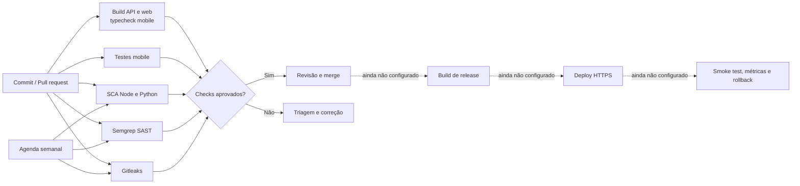
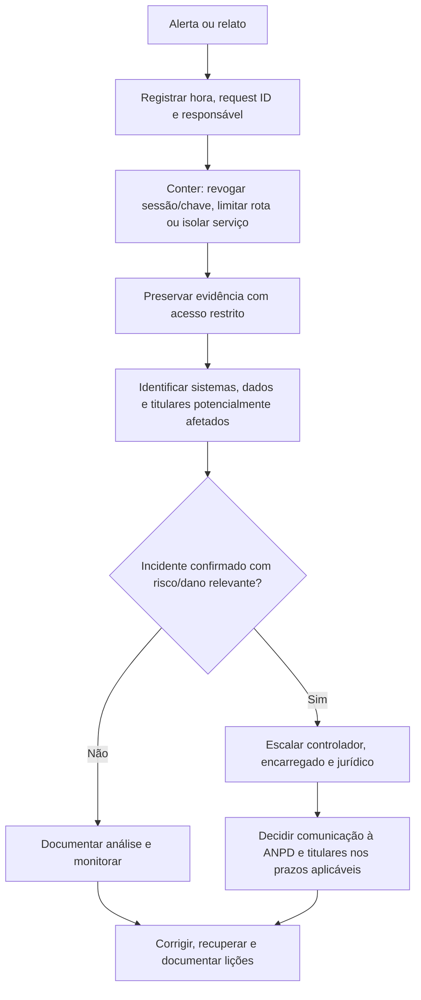

# Sprint 3 — Cibersegurança e privacidade

**Projeto:** Ford Vínculo 360  
**Revisão:** 27/09/2026  
**Escopo:** código e artefatos versionados neste workspace. Esta entrega não é pentest, certificação, parecer jurídico nem evidência de um ambiente de produção.

## Parecer executivo

O projeto tem controles de autenticação, sessão, autorização, validação, auditoria, proteção de API e uma automação DevSecOps configurada. Nesta revisão corrigi um risco alto: links de convite, ativação e redefinição de senha podiam ser gravados na fila de e-mail e apresentados a administradores. Esses fluxos agora enviam o conteúdo sensível sem persistir link ou corpo, redigem a resposta da fila, bloqueiam reenvio e invalidam o token quando o envio falha. Logs de requisição agora registram também respostas de guards e throttling, sem corpo, query, cookie ou identificador pessoal.

**Estado da entrega:** documentação, controles de aplicação e pipeline de segurança foram publicados e verificados no GitHub. A execução completa do CI passou em 27/09/2026 no commit `e443bfa` (build, typecheck, testes mobile, auditorias Node/Python, Semgrep e Gitleaks). **Ainda não está pronta para produção.** Permanecem pendências de ambiente e governança: branch protection indisponível no plano atual para este repositório privado, implantação, saneamento histórico, observabilidade, prova de cifragem/restauração, revisão LGPD pelo controlador e avaliação independente.

| Frente | Estado | Evidência e limite |
|---|---|---|
| DevSecOps | CI executado e aprovado | Execução [36345975178](https://github.com/vinycius11dev/ford-vinculo-360/actions/runs/36345975178), commit `e443bfa`. Alertas de dependências e atualizações de segurança Dependabot ativos; não há CD/deploy. |
| API e identidade | Controles implementados | JWT curto, refresh rotativo, hash de refresh/reset/convite, RBAC/escopo, limites, CORS, Helmet, validação de segredo/configuração e logs sem dados de conteúdo. |
| Mensagens com credenciais | Corrigido para novos envios | Tokens não entram na fila nem em eventos; respostas administrativas são redigidas; falha invalida a credencial. Dados antigos ainda exigem saneamento controlado. |
| Mobile | Proteção local implementada; publicação pendente | Refresh token em SecureStore; token de acesso em memória. Não há APK assinado, endpoint HTTPS de produção nem evidência em dispositivo. |
| Observabilidade | Plano e formato prontos; operação pendente | Logs JSON estruturados no processo. Não há coletor, dashboard, alerta configurado, retenção centralizada ou simulado comprovado. |
| LGPD | Controles e checklist documentados; governança pendente | Bases legais, prazos, contratos, RIPD quando aplicável e decisões do controlador precisam de validação formal. |
| IoT/MQTT e IaC | Fora do escopo implementado | Nenhum broker, cliente MQTT, container ou IaC foi encontrado. Requisitos futuros estão descritos abaixo. |

## Fluxo DevSecOps e implantação



O workflow está definido para `push`, `pull_request`, execução manual e agenda semanal. Permissões do workflow limitadas a `contents: read`; actions fixadas por SHA. O repositório GitHub é privado, com alertas de vulnerabilidade e correções automáticas do Dependabot habilitados; as atualizações semanais têm cooldown de sete dias. As permissões padrão do `GITHUB_TOKEN` estão limitadas a leitura e o token não pode aprovar PRs. A conta atual não permite branch protection nesse repositório privado; o GitHub exige plano Pro ou repositório público. O repositório permanece privado. Não há CD/deploy, verificação pós-deploy nem rollback configurados.

| Verificação | Configuração atual | O que comprova / limite |
|---|---|---|
| Build e tipos | `pnpm check` | Build API/web e typecheck mobile; não é teste dinâmico de segurança. |
| Testes mobile | `pnpm test:mobile` no workflow | Testes de sessão/contrato; não substituem teste em aparelho ou testes de API. |
| SCA Node | `pnpm audit --audit-level high` | Inclui dependências de produção e desenvolvimento; resultado varia com o advisory registry. |
| SCA Python | `pip-audit -r apps/ml/requirements.txt` | Dependências declaradas; ainda falta lockfile Python para reprodutibilidade. |
| SAST | Semgrep CLI 1.178.0, `semgrep scan --config p/default --error --metrics=off --oss-only` | Execução passou no CI de 27/09/2026, sem findings bloqueadores. |
| Segredos | Gitleaks 8.30.1 com checksum SHA-256 e histórico completo | Encontrar chave implica revogar/rotacionar; apagar do último commit não basta. |
| Dependabot | `.github/dependabot.yml` | Alertas e correções automáticas ativos; atualizações semanais de GitHub Actions, npm e pip com cooldown de sete dias. |
| IaC/container | Não configurado | Não há IaC/container neste escopo; adicionar scanner correspondente se esses artefatos forem introduzidos. |
| Deploy e rollback | Não configurados | Escolher ambiente, artefato, aprovação, smoke test, estratégia de rollback e gestão de segredos. |

### Portão de release recomendado

1. Build e todos os scanners verdes; findings aceitos devem ter responsável, justificativa e prazo.
2. Pull request revisado por outra pessoa; checks obrigatórios e proteção da branch no GitHub.
3. Segredos injetados pelo ambiente, migração revisada, backup cifrado e restauração comprovada.
4. Release para homologação, smoke test de autenticação/autorização e validação de logs/alertas.
5. Deploy gradual com health check; reverter release se falhar autenticação, disponibilidade ou integridade dos dados.

## Controles no código

| Controle | Implementação/evidência | Limite ou próxima ação |
|---|---|---|
| Senha e sessão | bcrypt; access JWT de 15 min; refresh aleatório rotativo, guardado por hash SHA-256; sessão, expiração, revogação e `sessionVersion` verificadas | MFA e detecção de credencial comprometida não demonstrados. |
| Reset e convite | Hash no banco, expiração curta e invalidação de credenciais anteriores | Envio novo é síncrono; se falhar, token é invalidado. Em desenvolvimento, token de teste só aparece com flag explícita, sem SMTP e bind local. |
| Outbox de e-mail | `sendSensitive()` persiste payload redigido; conteúdo vai ao provedor apenas em memória; API omite payload/detalhes; reenvio de credenciais bloqueado | Linhas históricas enviadas/falhas e backups podem conter links antigos; requer saneamento/rotação antes de produção. |
| Logs de e-mail | Provedor console/SMTP não registra destinatário, assunto ou corpo; erros persistidos são mensagens genéricas | Logs do provedor externo têm política própria e precisam de retenção/acesso contratados. |
| HTTP | Helmet; CORS por origem exata; `x-request-id`; middleware registra rota/status/duração após a resposta | `/docs` desligado em produção; rever acesso a `/health` e arquivos públicos na topologia final. |
| Configuração | `NODE_ENV` explícito; produção exige CORS HTTPS, `PUBLIC_API_ORIGIN` HTTPS e `JWT_SECRET` com ao menos 32 bytes; bind local em desenvolvimento; cookies `Secure` fora de desenvolvimento | Guardar/rotacionar segredos no gerenciador do ambiente; `.env.example` contém apenas valores demonstrativos locais. |
| Throttling e lockout | Global 120/min; limites menores nas rotas de autenticação; upload 10/min e 5 MB; bloqueio após falhas repetidas | Atualização do lockout agora é atômica no MySQL; falta teste concorrente em banco efêmero. Throttling permanece em memória e por instância. |
| Upload | Aceita JPG/PNG/WebP; tamanho máximo 5 MB; assinatura binária conferida contra MIME declarado; nome aleatório | Completar varredura de malware e política de retenção se uploads entrarem em produção. |
| Autorização | Guards de JWT, papel e escopo por usuário/concessionária; trilha de auditoria | Executar matriz de testes negativos BOLA/BFLA nos endpoints em banco efêmero. |
| Mobile | Refresh em `expo-secure-store`; access token em memória | Assinar/publicar o app, fornecer endpoint HTTPS e validar deep links e TLS em dispositivo. |
| Dados em repouso | Hashes de senha/token; segregação de acesso no app | Não há prova de cifragem de banco/disco; `scripts/backup-wamp.ps1` gera backup SQL sem cifragem demonstrada. Configurar cifragem no volume/serviço e backups com chave separada, retenção e teste de restauração. |

### Registros históricos de mensagens com credenciais

O código antigo podia guardar um link de reset/convite em `OutboundMessage.payload` e o corpo renderizado em `MessageEvent.detail`. O novo endpoint já redige ambos; filas antigas em estado pendente são canceladas e redigidas quando o worker as processa, em vez de enviadas. Registros históricos já enviados/falhos e cópias de backup não são apagados automaticamente. Antes de usar dados reais, pare o worker, faça backup cifrado e restrito, localize e saneie payloads/eventos dos templates `TEAM_INVITATION`, `CUSTOMER_ACTIVATION`, `PASSWORD_RESET` e `VEHICLE_APPROVED`; invalide hashes ainda ativos e registre contagem/resultado sem copiar os tokens para logs. Reemita apenas credenciais necessárias. A limpeza do banco local não altera backups antigos: retenha-os bloqueados até expirarem conforme política ou refaça-os de forma segura.

## STRIDE e referências OWASP

O planejamento está alinhado como referência com [OWASP ASVS 5.0.0](https://owasp.org/projects/asvs), [OWASP API Security Top 10 — 2023](https://api-security.owasp.org/editions/2023/en/0x00-header/) e [OWASP Mobile Top 10 — 2024](https://owasp.org/projects/mobile-top-10). Isso não equivale a declarar conformidade: ainda faltam testes sistemáticos e evidência independente.

| STRIDE | Cenário | Controles observados | Lacuna/próxima verificação |
|---|---|---|---|
| Spoofing | Roubo/reuso de senha, refresh, convite ou reset | bcrypt, tokens curtos/aleatórios, hash de refresh/reset/convite, rotação, expiração, lockout atômico e throttling | MFA, credential stuffing e teste concorrente do lockout em banco isolado. |
| Tampering | Alterar VIN, papel, concessionária, OS ou estado de negócio | DTOs, guards, transações e auditoria | Testes negativos de propriedade/escopo em todas as rotas. |
| Repudiation | Negar ação sobre dado/conta | Audit log de domínio e request ID | Centralização, retenção, controle de acesso e proteção contra alteração dos logs. |
| Information disclosure | Acesso a outro cliente/unidade, arquivo ou credencial | Escopo por papel, restrição de resposta, cookie HttpOnly/Secure, redação de mensagens/logs | Saneamento histórico, criptografia de backup/volume e revisão do OpenAPI/respostas. |
| Denial of service | Brute force, upload ou chamadas custosas | Rate limit, tamanho de upload e timeouts | Limite compartilhado entre réplicas; carga/abuso em ambiente isolado. |
| Elevation of privilege | Usuário agir como gerente/admin ou acessar outro escopo | Papel carregado no servidor, `RolesGuard` e filtros de escopo | Matriz BOLA/BFLA e revisão periódica de permissões. |

### Matriz de cobertura da rubrica

| Referência | Cobertura nesta entrega | Evidência | Falta para fechar |
|---|---|---|---|
| OWASP ASVS | Baseline de identidade, sessão, validação, autorização, configuração, logs e proteção de dados | Tabelas STRIDE/controles e referências acima | Checklist ASVS rastreado por requisito, testes e revisão independente. |
| API Security Top 10 | Planejado para BOLA/BFLA, autenticação, consumo de recursos, configuração e APIs externas | Guards, limites, CORS, validação; planos de testes | Executar testes negativos, limites distribuídos e revisão de endpoints. |
| Mobile Top 10 | SecureStore, access token em memória, TLS como requisito | Código mobile existente e checklist | Build assinado, revisão de deep links, proxy/TLS e evidência em dispositivo. |
| LGPD | Minimização/escopo, auditoria e fluxos de privacidade previstos | `docs/security-lgpd.md`, módulos de privacidade e este relatório | Controlador/encarregado: finalidade/base legal, retenção, contratos, direitos e RIPD quando aplicável. |
| DevSecOps | CI completo passou; alertas de vulnerabilidade e Dependabot ativos | `.github/workflows/security.yml`, `.github/dependabot.yml`, execução GitHub [36346101380](https://github.com/vinycius11dev/ford-vinculo-360/actions/runs/36346101380) | Branch protection requer plano GitHub compatível para este repositório privado; configurar release/deploy e revisar achados futuros. |

## Logs estruturados e plano de monitoramento

O middleware escreve JSON após cada resposta, incluindo guards/erros HTTP: `event`, `method`, rota registrada (ou `[unmatched]`), `statusCode`, `durationMs` e `requestId`. Não grava corpo, query string, cookies, destinatário ou token. Eventos de domínio continuam registrados no audit log; falhas de mensageria usam tipo de erro, sem conteúdo do provedor. Os exemplos são **sintéticos**, apenas para demonstrar o formato; não são logs coletados em produção.

```json
{"event":"http.request","method":"POST","path":"/api/v1/auth/login","statusCode":200,"durationMs":84,"requestId":"e45de78c-3d2a-4e68-88dc-f691a901d094"}
{"event":"http.request","method":"POST","path":"/api/v1/auth/login","statusCode":401,"durationMs":31,"requestId":"71c663e9-65de-4d85-9fb8-11ab083c7dd7"}
{"event":"http.request","method":"POST","path":"/api/v1/auth/password-reset/request","statusCode":429,"durationMs":2,"requestId":"2ed00d74-5c7d-4b5c-8c8b-2c2403511151"}
{"event":"message.sensitive_delivery_failed","messageId":"msg_example","errorType":"Error"}
{"event":"audit.domain_change","action":"TEAM_INVITATION_CREATE","entityType":"UserInvitation","requestId":"e45de78c-3d2a-4e68-88dc-f691a901d094"}
```

| Painel/indicador a configurar | Gatilho inicial proposto | Resposta |
|---|---|---|
| API: 5xx e disponibilidade | 5xx > 5% em 5 min ou health check indisponível | Acionar responsável, comparar release, limitar tráfego/reverter se regressão. |
| Latência API | p95 > 800 ms por 5 min | Separar latência DB/ML, olhar rota e capacidade; ajustar limite depois de baseline real. |
| Abuso/autenticação | 401/429 ou bloqueios acima de 3× baseline por 10 min | Verificar distribuição/rota, preservar request IDs, conter origem sem bloquear clientes legítimos em massa. |
| Autorização | Pico de 403 ou tentativas de acesso cruzado | Revisar audit log e escopo; revogar sessão/chave se confirmado. |
| Mensageria | Falhas consecutivas de e-mail ou fila crescente por 10 min | Validar SMTP, domínio e fila; gerar credencial nova quando a mensagem sensível falhar. |
| Mobile | Crash-free sessions < 99% após release | Pausar rollout e comparar versão/aparelho; rollback se regressão confirmada. |
| ML | Timeout/5xx ou p95 acima do SLO definido para o piloto | Manter ML em rede privada, avaliar fallback e separar falha de API. |
| Backup | Job ausente/falha ou restore fora do RTO | Suspender release de dados reais até obter backup cifrado e restore comprovado. |
| IoT | Sem painel enquanto não houver integração | Antes de entrar no escopo, definir métricas de conexão, certificados, ACL, replay e volume por dispositivo. |

Os limites acima são **proposta**, não estão configurados nem calibrados por tráfego real. Implementar coletor central, retenção, controle de acesso e dashboard (API, autenticação, mobile, ML, mensagens e backup); anexar screenshots e um conjunto real de logs sanitizados após homologação. Não incluir e-mail, CPF, VIN completo, token, corpo de mensagem ou query string nos painéis.

## Plano de resposta a incidentes



Operação a preparar: plantonista/substituto, contatos do controlador/encarregado, severidade, canal seguro, preservação de evidências, processo de rotação de credenciais, comunicação, restauração e simulado. A ANPD informa comunicação pelo controlador à Autoridade e aos titulares em até **3 dias úteis** para incidente que possa causar risco ou dano relevante, conforme a Resolução CD/ANPD nº 15/2024; analisar exceções/regras específicas com o jurídico. Agentes de tratamento de pequeno porte podem ter prazo em dobro conforme Resolução CD/ANPD nº 2/2022 quando elegíveis; não presumir enquadramento. A ANPD também informa obrigação de manter registro dos incidentes por pelo menos cinco anos. Fontes oficiais: [orientação sobre comunicação de incidente](https://www.gov.br/anpd/pt-br/canais_atendimento/agente-de-tratamento/comunicado-de-incidente-de-seguranca-cis), [Resolução nº 2/2022](https://www.gov.br/anpd/pt-br/acesso-a-informacao/institucional/atos-normativos/regulamentacoes_anpd/resolucao-cd-anpd-no-2-de-27-de-janeiro-de-2022) e [notícia sobre o regulamento de comunicação](https://www.gov.br/anpd/pt-br/assuntos/noticias/anpd-aprova-o-regulamento-de-comunicacao-de-incidente-de-seguranca).

## LGPD, retenção e segurança de infraestrutura

O sistema trata dados de conta/contato, sessão e relacionamento com veículos. VIN, placa e histórico devem ser classificados segundo contexto e possibilidade de associação a pessoa; não presumir anonimização. O código tem escopo de acesso, auditoria e fluxos de privacidade, mas o repositório não comprova cifragem de banco/disco nem dos backups locais. Para dados reais: ativar cifragem do volume/serviço e do backup, guardar chaves separadamente, restringir acesso, definir retenção/exclusão e comprovar restauração. Dados de incidente têm retenção mínima regulatória própria; alinhar o plano geral de logs com o jurídico.

Antes da operação, o controlador e o encarregado devem validar finalidade/base legal por fluxo, minimização, retenção, compartilhamento com concessionárias/fornecedores, direitos dos titulares, contratos e necessidade de RIPD. A equipe técnica não determina sozinha a base legal nem declara conformidade jurídica.

### IoT/MQTT e infraestrutura futura

Não foi implementado broker/cliente MQTT nem encontrado manifesto de infra/container. Se telemetria entrar no escopo, exigir rede privada, MQTT sobre TLS 1.2+, certificado individual/mTLS, `allow_anonymous=false`, ACL por tópico/dispositivo, rotação/revogação, validação de schema, limite de frequência, timestamp/nonce contra replay e monitoramento de conexão. Não usar VIN/e-mail como tópico identificador. Adicionar verificação de IaC/container (por exemplo, scanner de imagem/configuração) somente quando tais artefatos forem criados. Este baseline é requisito futuro, não controle instalado.

## Evidências desta revisão e checklist

| Evidência | Estado nesta revisão | Observação |
|---|---|---|
| Revisão de código | Feita | Inclui autenticação, fila de mensagens, middleware de logs, upload, configuração e workflow. |
| Build/typecheck | Passou no CI em 27/09/2026 | Build API/web e typecheck mobile; Vite ainda emite aviso de bundle JavaScript acima de 500 kB. Não envolve banco ou envio real de e-mail. |
| SCA Node | `pnpm audit --audit-level high` passou no CI em 27/09/2026 | Nenhuma vulnerabilidade de severidade alta ou crítica conhecida no registro consultado nessa execução. |
| SCA Python | `pip-audit -r apps/ml/requirements.txt` passou no CI em 27/09/2026 | Sem vulnerabilidades conhecidas nas dependências declaradas; ainda falta lockfile para reprodutibilidade. |
| Semgrep | Passou no CI em 27/09/2026 | 507 regras em 256 arquivos; sem findings bloqueadores após endurecer as políticas de dependências. |
| Gitleaks | Passou no CI em 27/09/2026 | Varredura de código e histórico completo, sem segredos detectados. |
| Testes mobile | Passaram no CI em 27/09/2026 | Testes de contrato/sessão; não equivalem a QA em aparelho. |
| Integração com DB/SMTP | Não executada | Ambiente local tem serviços ativos; não alterei banco nem disparei e-mails nesta revisão. |
| Dashboard/prints/pentest | Não disponíveis | Precisam ser gerados em homologação real, sem dados pessoais. |

### Checklist de encerramento

- [x] Preparar workflow de build, testes mobile, SCA, SAST e detecção de segredos.
- [x] Endurecer configuração HTTPS/CORS, segredo JWT, bind local, cookie, upload e logs HTTP.
- [x] Impedir persistência/exposição de links de reset, convite e ativação em mensagens novas.
- [x] Mapear STRIDE, referências OWASP, LGPD, monitoramento, incidentes e baseline IoT.
- [x] Executar auditoria completa das dependências Node; sem vulnerabilidades conhecidas no momento consultado.
- [x] Confirmar build/typecheck após esta revisão; registrar aviso do bundle web para otimização futura.
- [x] Publicar o repositório privado e executar CI completo; build, testes, SCA, Semgrep e Gitleaks aprovados no commit `e443bfa`.
- [ ] Ativar branch protection — indisponível no plano atual para repositório privado; avaliar upgrade para GitHub Pro. Configurar também release/deploy, smoke test e rollback.
- [ ] Saneamento controlado dos registros/backups antigos com links de credencial antes de produção.
- [ ] Cifrar banco/volume e backups, limitar acesso e provar restore.
- [ ] Configurar coletor/dashboard/alertas e anexar prints/logs reais sanitizados.
- [ ] Validar API e app mobile em homologação/aparelho com HTTPS e testes BOLA/BFLA.
- [ ] Obter aprovação do controlador/encarregado/jurídico e avaliação independente antes de produção.

**Conclusão:** a entrega de documentação, controles de aplicação, políticas de dependências e pipeline CI está publicada; o CI completo passou no GitHub no commit `e443bfa`. Isso comprova build, testes e scanners nesse commit, mas não certifica produção. Antes de produção, a prioridade é sanear registros/backups históricos com links de credencial; depois comprovar cifragem/restauração, observabilidade, implantação segura e revisão formal. A proteção de `main` requer plano GitHub compatível enquanto o repositório permanecer privado.
