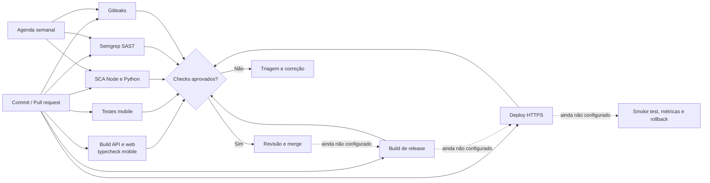
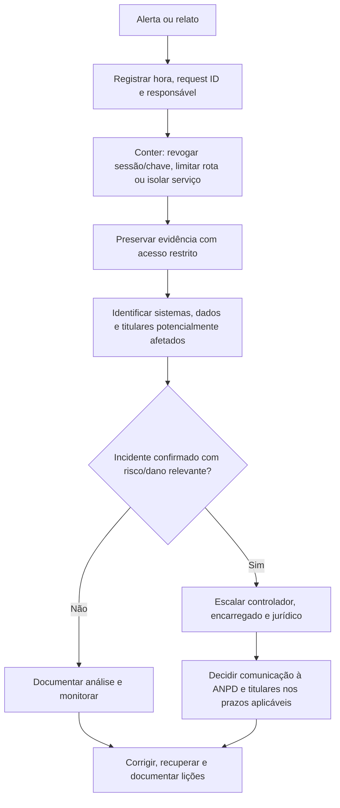

# Sprint 3 — Cibersegurança e privacidade

**Projeto:** Ford Vínculo 360  
**Revisão:** 27/09/2026  
**Escopo:** código e artefatos versionados neste workspace. Esta entrega não é pentest, certificação, parecer jurídico nem evidência de um ambiente de produção.

## Parecer executivo

O projeto tem controles de autenticação, sessão, autorização, validação, auditoria, proteção de API e automação DevSecOps. Esta revisão também corrige falhas de autorização entre concessionárias: ordens de serviço consultam o escopo do veículo, leads são listados e alterados apenas pela unidade autorizada, e uma troca só encerra a titularidade ativa do cliente da venda. Agentes não podem emitir pontos manualmente. No mobile, o perfil de produção exige endpoint HTTPS explícito e bloqueia o envio de credenciais se a configuração estiver ausente ou insegura. Links sensíveis de convite/reset também não são persistidos na fila de e-mail, e os logs HTTP não incluem payload, query, cookie ou identificadores pessoais.

**Estado da entrega:** alterações publicadas em `main`; o CI completo passou em 27/09/2026 na execução [36349554276](https://github.com/vinycius11dev/ford-vinculo-360/actions/runs/36349554276), commit `e326b7b`. Passaram build/typecheck, testes API/mobile, SCA Node/Python, Semgrep, Gitleaks e self-test criptográfico com fixture sintética. **Ainda não está pronta para produção.** Permanecem pendências operacionais: branch protection e canal privado de divulgação indisponíveis no plano atual para este repositório privado, deploy, saneamento histórico autorizado, cofre/destino externo de backup, dashboard/alertas, revisão LGPD pelo controlador e avaliação independente.

| Frente | Estado | Evidência e limite |
|---|---|---|
| DevSecOps | CI completo aprovado | Execução [36349554276](https://github.com/vinycius11dev/ford-vinculo-360/actions/runs/36349554276), commit `e326b7b`. Alertas de vulnerabilidade e Dependabot ativos; não há CD/deploy. |
| API e identidade | Controles implementados | JWT curto, refresh rotativo, hash de refresh/reset/convite, RBAC/escopo, limites, CORS, Helmet, validação de segredo/configuração e logs sem dados de conteúdo. |
| Mensagens com credenciais | Corrigido para novos envios | Tokens não entram na fila nem em eventos; respostas administrativas são redigidas; falha invalida a credencial. Dados antigos ainda exigem saneamento controlado. |
| Mobile | Controles implementados; publicação pendente | Refresh token em SecureStore e token de acesso em memória. O perfil EAS de produção exige EXPO_PUBLIC_API_URL HTTPS e recusa requests sem isso; falta cadastrar o endpoint real e validar em dispositivo. |
| Observabilidade | Plano e formato prontos; operação pendente | Logs JSON estruturados no processo. Não há coletor, dashboard, alerta configurado, retenção centralizada ou simulado comprovado. |
| LGPD | Controles e checklist documentados; governança pendente | Bases legais, prazos, contratos, RIPD quando aplicável e decisões do controlador precisam de validação formal. |
| Backup local | Ferramenta cifrada entregue; ensaio pendente | AES-256-GCM, frase secreta fora do disco e restauração isolada estão implementados. Nenhuma conexão, dump ou restore real foi executado; backups antigos em claro permanecem intactos. |
| IoT/MQTT e IaC | Fora do escopo implementado | Nenhum broker, cliente MQTT, container ou IaC foi encontrado. Requisitos futuros estão descritos abaixo. |


## Rastreabilidade das quatro atividades do enunciado

| Atividade e peso | Evidências desta entrega | Estado e itens operacionais pendentes |
|---|---|---|
| 1. Pipeline DevSecOps Integrado (3,0) | Workflow com build/typecheck, testes de segurança, SCA Node/Python, Semgrep e Gitleaks; execução [36349554276](https://github.com/vinycius11dev/ford-vinculo-360/actions/runs/36349554276). | CI e scanners estão entregues. Proteção obrigatória da branch e deploy/rollback dependem de plano e ambiente compatíveis. |
| 2. Segurança em Código e Infraestrutura (2,5) | Autenticação e escopo API, correções de autorização, armazenamento seguro e política HTTPS mobile, criptografia local de backup, exemplos técnicos e testes. | Não existe integração MQTT/IaC no projeto. O endpoint HTTPS real do EAS, saneamento histórico e ensaio operacional continuam dependentes do responsável pelo ambiente. |
| 3. Observabilidade, Monitoramento e Resposta (2,0) | Logs JSON sem payload/segredos, indicadores e limites propostos, painel a configurar e fluxo documentado de resposta a incidentes. | Não há coletor, dashboard, alertas calibrados nem simulado de incidente em ambiente real; não apresentamos telas ou logs sintéticos como evidência de produção. |
| 4. Compliance, Riscos e Segurança Contínua (2,5) | STRIDE, referências OWASP, checklist LGPD, análise de riscos, workflow semanal, procedimento seguro de backup e saneamento. | Conformidade formal, bases legais/retenção, aprovação do controlador, revisão independente e comprovantes operacionais precisam ser fornecidos pela organização. |

O relatório separa controles implementados, evidências verificáveis e requisitos que dependem de ambiente/decisão externa. A conclusão descreve prontidão para avaliação acadêmica do trabalho versionado; não declara certificação nem prontidão de produção.

## Atividade 1 (3,0) - Pipeline DevSecOps Integrado



O workflow está definido para `push`, `pull_request`, execução manual e agenda semanal. Permissões do workflow limitadas a `contents: read`; actions fixadas por SHA. O repositório GitHub é privado, com alertas de vulnerabilidade e correções automáticas do Dependabot habilitados; as atualizações semanais têm cooldown de sete dias. As permissões padrão do `GITHUB_TOKEN` estão limitadas a leitura e o token não pode aprovar PRs. A conta atual não permite branch protection nesse repositório privado; o GitHub exige plano Pro ou repositório público. O repositório permanece privado. Não há CD/deploy, verificação pós-deploy nem rollback configurados.

| Verificação | Configuração atual | O que comprova / limite |
|---|---|---|
| Build e tipos | `pnpm check` | Build API/web e typecheck mobile; não é teste dinâmico de segurança. |
| Testes API/mobile/backup | Testes de autorização API, transporte TLS mobile, contratos/sessão e self-test AES-GCM com fixture sintética | Não usam banco real; não substituem testes em aparelho nem a matriz BOLA/BFLA integral. |
| SCA Node | `pnpm audit --audit-level high` | Passou na execução final [36349554276](https://github.com/vinycius11dev/ford-vinculo-360/actions/runs/36349554276); inclui dependências de produção e desenvolvimento e varia com o advisory registry. |
| SCA Python | `pip-audit -r apps/ml/requirements.txt` | Passou na execução final; audita dependências declaradas. Ainda falta lockfile Python para reprodutibilidade. |
| SAST | Semgrep CLI 1.178.0, `semgrep scan --config p/default --error --metrics=off --oss-only` | Passou na execução final, sem findings bloqueadores. |
| Segredos | Gitleaks 8.30.1 com checksum SHA-256 e histórico completo | Passou na execução final. Uma exceção exata documenta o texto público dos parâmetros scrypt no manifesto; não é credencial. |
| Dependabot | `.github/dependabot.yml` | Alertas e correções automáticas ativos; atualizações semanais de GitHub Actions, npm e pip com cooldown de sete dias. |
| IaC/container | Não configurado | Não há IaC/container neste escopo; adicionar scanner correspondente se esses artefatos forem introduzidos. |
| Deploy e rollback | Não configurados | Escolher ambiente, artefato, aprovação, smoke test, estratégia de rollback e gestão de segredos. |

### Portão de release recomendado

1. Build e todos os scanners verdes; findings aceitos devem ter responsável, justificativa e prazo.
2. Pull request revisado por outra pessoa; checks obrigatórios e proteção da branch no GitHub.
3. Segredos injetados pelo ambiente, migração revisada, backup cifrado e restauração comprovada.
4. Release para homologação, smoke test de autenticação/autorização e validação de logs/alertas.
5. Deploy gradual com health check; reverter release se falhar autenticação, disponibilidade ou integridade dos dados.

## Atividade 2 (2,5) - Segurança em Código e Infraestrutura

| Controle | Implementação/evidência | Limite ou próxima ação |
|---|---|---|
| Senha e sessão | bcrypt; access JWT de 15 min; refresh aleatório rotativo, guardado por hash SHA-256; sessão, expiração, revogação e `sessionVersion` verificadas | MFA e detecção de credencial comprometida não demonstrados. |
| Reset e convite | Hash no banco, expiração curta e invalidação de credenciais anteriores | Envio novo é síncrono; se falhar, token é invalidado. Em desenvolvimento, token de teste só aparece com flag explícita, sem SMTP e bind local. |
| Outbox de e-mail | `sendSensitive()` persiste payload redigido; conteúdo vai ao provedor apenas em memória; API omite payload/detalhes; reenvio de credenciais bloqueado | Linhas históricas enviadas/falhas e backups podem conter links antigos; requer saneamento/rotação antes de produção. |
| Logs de e-mail | Provedor console/SMTP não registra destinatário, assunto ou corpo; erros persistidos são mensagens genéricas | Logs do provedor externo têm política própria e precisam de retenção/acesso contratados. |
| HTTP | Helmet; CORS por origem exata; `x-request-id`; middleware registra rota/status/duração após a resposta | `/docs` desligado em produção; rever acesso a `/health` e arquivos públicos na topologia final. |
| Configuração | `NODE_ENV` explícito; produção exige CORS HTTPS, `PUBLIC_API_ORIGIN` HTTPS e `JWT_SECRET` com ao menos 32 bytes; bind local em desenvolvimento; cookies `Secure` fora de desenvolvimento | Guardar/rotacionar segredos no gerenciador do ambiente; `.env.example` contém apenas valores demonstrativos locais. |
| Throttling e lockout | Global 120/min; limites menores nas rotas de autenticação; upload 10/min e 5 MB; bloqueio após falhas repetidas | Atualização do lockout agora é atômica no MySQL; falta teste concorrente em banco efêmero. Throttling permanece em memória e por instância. |
| Upload | Aceita JPG/PNG/WebP; tamanho máximo 5 MB; assinatura binária conferida contra MIME declarado; nome aleatório | Completar varredura de malware e política de retenção se uploads entrarem em produção. |
| Autorização | Guards JWT, papel e escopo; OS limita VIN ao escopo do ator, lead é isolado por concessionária e troca verifica titularidade do comprador | 6 testes negativos de API passam localmente; ampliar BOLA/BFLA para todas as rotas em banco efêmero. |
| Mobile | Refresh em expo-secure-store; access token em memória; perfil production exige HTTPS e bloqueia requests antes de enviar credenciais | 3 testes de transporte passam localmente; configurar EXPO_PUBLIC_API_URL HTTPS no EAS, assinar/publicar e validar deep links/TLS em dispositivo. |
| Dados em repouso | Hashes de senha/token; backup local cifrado em streaming com AES-256-GCM e diretório com ACL restrita | Cifragem do banco/volume não foi demonstrada. Falta ensaio supervisionado de restore, cofre para frase secreta, cópia externa, retenção e tratamento de dumps antigos em claro. |

### Trechos de código e rastreabilidade

Os trechos abaixo mostram as verificações centrais introduzidas nesta revisão. Os arquivos completos e testes estão versionados no repositório.

**Ordem de serviço: limitar a consulta do VIN ao escopo do usuário** — `apps/api/src/service-orders/service-orders.service.ts`

    const vehicle = await this.prisma.vehicle.findFirst({
      where: { vin: input.vin.toUpperCase(), ...vehicleScope(actor) },
    });

**Troca: encerrar somente a titularidade ativa do cliente da venda** — `apps/api/src/sales/sales.service.ts`

    where: {
      vehicleId: tradeIn.id,
      userId: customer.id,
      status: OwnershipStatus.ACTIVE,
    },

**Mobile: recusar request antes de enviar credenciais quando a URL de produção não é HTTPS** — `apps/mobile/src/session.ts`

    if (apiConfigurationError) throw new Error(apiConfigurationError);

**Backup: cifrar o fluxo SQL com AES-256-GCM antes de gravar em disco** — `scripts/secure-backup.cjs`

    const cipher = createCipheriv('aes-256-gcm', key, nonce, { authTagLength: TAG_LENGTH });

Código publicado em `e326b7b`; a execução [36349554276](https://github.com/vinycius11dev/ford-vinculo-360/actions/runs/36349554276) passou com os checks listados na Atividade 1. Os testes locais API/mobile usam mocks; a revisão não acessou dados reais.

### Registros históricos de mensagens com credenciais

O código antigo podia guardar um link de reset/convite em OutboundMessage.payload e o corpo renderizado em MessageEvent.detail. O novo endpoint redige ambos; filas antigas pendentes são canceladas e redigidas quando o worker as processa. Registros já enviados/falhos e cópias de backup não são apagados automaticamente. Antes de usar dados reais, pare todas as instâncias e workers, faça backup cifrado e restaure-o em banco descartável. Só então, com autorização e janela aprovadas, saneie payloads/eventos dos quatro templates sensíveis e invalide hashes ainda ativos. O procedimento em docs/operations-security.md exige dry-run por padrão, confirmação explícita e registro operacional ligado ao hash do backup. Ele não aplica mudanças nesta entrega nem altera backups antigos.

### IoT/MQTT e infraestrutura futura (requisito da Atividade 2)

Não foi implementado broker/cliente MQTT nem encontrado manifesto de infra/container. Se telemetria entrar no escopo, exigir rede privada, MQTT sobre TLS 1.2+, certificado individual/mTLS, `allow_anonymous=false`, ACL por tópico/dispositivo, rotação/revogação, validação de schema, limite de frequência, timestamp/nonce contra replay e monitoramento de conexão. Não usar VIN/e-mail como tópico identificador. Adicionar verificação de IaC/container (por exemplo, scanner de imagem/configuração) somente quando tais artefatos forem criados. Este baseline é requisito futuro, não controle instalado.

## Atividade 3 (2,0) - Observabilidade, Monitoramento e Resposta

O middleware escreve JSON após cada resposta, incluindo guards/erros HTTP: `event`, `method`, rota registrada (ou `[unmatched]`), `statusCode`, `durationMs` e `requestId`. Não grava corpo, query string, cookies, destinatário ou token. Eventos de domínio continuam registrados no audit log; falhas de mensageria usam tipo de erro, sem conteúdo do provedor. Os exemplos são **sintéticos**, apenas para demonstrar o formato; não são logs coletados em produção.

```json
{"event":"http.request","method":"POST","path":"/api/v1/auth/login","statusCode":200,"durationMs":84,"requestId":"e45de78c-3d2a-4e68-88dc-f691a901d094"}
{"event":"http.request","method":"POST","path":"/api/v1/auth/login","statusCode":401,"durationMs":31,"requestId":"71c663e9-65de-4d85-9fb8-11ab083c7dd7"}
{"event":"http.request","method":"POST","path":"/api/v1/auth/password-reset/request","statusCode":429,"durationMs":2,"requestId":"2ed00d74-5c7d-4b5c-8c8b-2c2403511151"}
{"event":"message.sensitive_delivery_failed","messageId":"msg_example","errorType":"Error"}
{"event":"audit.domain_change","action":"TEAM_INVITATION_CREATE","entityType":"UserInvitation","requestId":"e45de78c-3d2a-4e68-88dc-f691a901d094"}
```

| Painel/indicador a configurar | Gatilho inicial proposto | Resposta |
|---|---|---|
| API: 5xx e disponibilidade | 5xx > 5% em 5 min ou health check indisponível | Acionar responsável, comparar release, limitar tráfego/reverter se regressão. |
| Latência API | p95 > 800 ms por 5 min | Separar latência DB/ML, olhar rota e capacidade; ajustar limite depois de baseline real. |
| Abuso/autenticação | 401/429 ou bloqueios acima de 3× baseline por 10 min | Verificar distribuição/rota, preservar request IDs, conter origem sem bloquear clientes legítimos em massa. |
| Autorização | Pico de 403 ou tentativas de acesso cruzado | Revisar audit log e escopo; revogar sessão/chave se confirmado. |
| Mensageria | Falhas consecutivas de e-mail ou fila crescente por 10 min | Validar SMTP, domínio e fila; gerar credencial nova quando a mensagem sensível falhar. |
| Mobile | Crash-free sessions < 99% após release | Pausar rollout e comparar versão/aparelho; rollback se regressão confirmada. |
| ML | Timeout/5xx ou p95 acima do SLO definido para o piloto | Manter ML em rede privada, avaliar fallback e separar falha de API. |
| Backup | Job ausente/falha ou restore fora do RTO | Suspender release de dados reais até obter backup cifrado e restore comprovado. |
| IoT | Sem painel enquanto não houver integração | Antes de entrar no escopo, definir métricas de conexão, certificados, ACL, replay e volume por dispositivo. |

Os limites acima são **proposta**, não estão configurados nem calibrados por tráfego real. Implementar coletor central, retenção, controle de acesso e dashboard (API, autenticação, mobile, ML, mensagens e backup); anexar screenshots e um conjunto real de logs sanitizados após homologação. Não incluir e-mail, CPF, VIN completo, token, corpo de mensagem ou query string nos painéis.

### Resposta a incidentes



Operação a preparar: plantonista/substituto, contatos do controlador/encarregado, severidade, canal seguro, preservação de evidências, processo de rotação de credenciais, comunicação, restauração e simulado. A ANPD informa comunicação pelo controlador à Autoridade e aos titulares em até **3 dias úteis** para incidente que possa causar risco ou dano relevante, conforme a Resolução CD/ANPD nº 15/2024; analisar exceções/regras específicas com o jurídico. Agentes de tratamento de pequeno porte podem ter prazo em dobro conforme Resolução CD/ANPD nº 2/2022 quando elegíveis; não presumir enquadramento. A ANPD também informa obrigação de manter registro dos incidentes por pelo menos cinco anos. Fontes oficiais: [orientação sobre comunicação de incidente](https://www.gov.br/anpd/pt-br/canais_atendimento/agente-de-tratamento/comunicado-de-incidente-de-seguranca-cis), [Resolução nº 2/2022](https://www.gov.br/anpd/pt-br/acesso-a-informacao/institucional/atos-normativos/regulamentacoes_anpd/resolucao-cd-anpd-no-2-de-27-de-janeiro-de-2022) e [notícia sobre o regulamento de comunicação](https://www.gov.br/anpd/pt-br/assuntos/noticias/anpd-aprova-o-regulamento-de-comunicacao-de-incidente-de-seguranca).

## Atividade 4 (2,5) - Compliance, Riscos e Segurança Contínua

O planejamento está alinhado como referência com [OWASP ASVS 5.0.0](https://owasp.org/projects/asvs), [OWASP API Security Top 10 — 2023](https://api-security.owasp.org/editions/2023/en/0x00-header/) e [OWASP Mobile Top 10 — 2024](https://owasp.org/projects/mobile-top-10). Isso não equivale a declarar conformidade: ainda faltam testes sistemáticos e evidência independente.

| STRIDE | Cenário | Controles observados | Lacuna/próxima verificação |
|---|---|---|---|
| Spoofing | Roubo/reuso de senha, refresh, convite ou reset | bcrypt, tokens curtos/aleatórios, hash de refresh/reset/convite, rotação, expiração, lockout atômico e throttling | MFA, credential stuffing e teste concorrente do lockout em banco isolado. |
| Tampering | Alterar VIN, papel, concessionária, OS, troca ou estado de negócio | DTOs, guards, transações, escopo derivado do usuário e checagem de titularidade; pontos manuais limitados por papel | Testes negativos novos passaram nos fluxos corrigidos; completar revisão em todas as rotas. |
| Repudiation | Negar ação sobre dado/conta | Audit log de domínio e request ID | Centralização, retenção, controle de acesso e proteção contra alteração dos logs. |
| Information disclosure | Acesso a outro cliente/unidade, arquivo ou credencial | Escopo por papel, restrição de resposta, cookie HttpOnly/Secure, redação de mensagens/logs | Saneamento histórico, criptografia de backup/volume e revisão do OpenAPI/respostas. |
| Denial of service | Brute force, upload ou chamadas custosas | Rate limit, tamanho de upload e timeouts | Limite compartilhado entre réplicas; carga/abuso em ambiente isolado. |
| Elevation of privilege | Usuário agir como gerente/admin ou acessar outro escopo | Papel carregado no servidor, `RolesGuard` e filtros de escopo | Matriz BOLA/BFLA e revisão periódica de permissões. |

### Matriz de cobertura da rubrica

| Referência | Cobertura nesta entrega | Evidência | Falta para fechar |
|---|---|---|---|
| OWASP ASVS | Baseline de identidade, sessão, validação, autorização, configuração, logs e proteção de dados | Tabelas STRIDE/controles e referências acima | Checklist ASVS rastreado por requisito, testes e revisão independente. |
| API Security Top 10 | Baseline para BOLA/BFLA, autenticação, consumo de recursos, configuração e APIs externas | Guards, limites, CORS, validação e testes negativos de escopo | Ampliar testes para todas as rotas e limites distribuídos. |
| Mobile Top 10 | SecureStore, access token em memória e bloqueio de HTTP no perfil de produção | Código mobile, EAS e testes de transporte | Cadastrar URL HTTPS no EAS, gerar build assinado e revisar deep links/proxy em dispositivo. |
| LGPD | Minimização/escopo, auditoria e fluxos de privacidade previstos | `docs/security-lgpd.md`, módulos de privacidade e este relatório | Controlador/encarregado: finalidade/base legal, retenção, contratos, direitos e RIPD quando aplicável. |
| DevSecOps | CI completo passou | `.github/workflows/security.yml`, `.github/dependabot.yml`, execução [36349554276](https://github.com/vinycius11dev/ford-vinculo-360/actions/runs/36349554276) | Branch protection requer plano GitHub compatível para este repositório privado; configurar release/deploy e revisar achados futuros. |

### LGPD, retenção e segurança de infraestrutura

O sistema trata dados de conta/contato, sessão e relacionamento com veículos. VIN, placa e histórico devem ser classificados segundo contexto e possibilidade de associação a pessoa; não presumir anonimização. O código aplica escopo de acesso e auditoria; os scripts agora cifram backups locais em AES-256-GCM e restringem a ACL. O repositório não comprova cifragem do banco/disco nem destino externo de backup. Antes de dados reais, guardar a frase secreta em cofre aprovado, estabelecer cópia externa e retenção, comprovar restore supervisionado e tratar os dumps históricos em claro.

Antes da operação, o controlador e o encarregado devem validar finalidade/base legal por fluxo, minimização, retenção, compartilhamento com concessionárias/fornecedores, direitos dos titulares, contratos e necessidade de RIPD. A equipe técnica não determina sozinha a base legal nem declara conformidade jurídica.


### Evidências desta revisão e checklist

| Evidência | Estado nesta revisão | Observação |
|---|---|---|
| Revisão de código | Feita | Inclui autenticação, fila de mensagens, middleware de logs, upload, configuração e workflow. |
| Build/typecheck | Passou no CI em 27/09/2026 | Build API/web e typecheck mobile; Vite ainda emite aviso de bundle JavaScript acima de 500 kB. Não envolve banco ou envio real de e-mail. |
| SCA Node | `pnpm audit --audit-level high` passou no CI | Nenhuma vulnerabilidade de severidade alta ou crítica conhecida no registro consultado nessa execução. |
| SCA Python | `pip-audit -r apps/ml/requirements.txt` passou no CI | Sem vulnerabilidades conhecidas nas dependências declaradas; ainda falta lockfile para reprodutibilidade. |
| Semgrep | Passou no CI em 27/09/2026 | 507 regras em 256 arquivos; sem findings bloqueadores. |
| Gitleaks | Passou no CI em 27/09/2026 | Varredura de histórico completo. O único finding era a descrição scrypt, liberada por fingerprint exato em `.gitleaksignore`. |
| Testes CI | Todos passaram na execução [36349554276](https://github.com/vinycius11dev/ford-vinculo-360/actions/runs/36349554276) | Build/typecheck, testes API/mobile, auditorias, Semgrep, Gitleaks e fixture criptográfica; não equivale a QA em aparelho. |
| Lint | Não executado nesta revisão | ESLint 9 local não encontra configuração eslint.config.*; lint não é check obrigatório na pipeline atual. |
| Exceção Gitleaks | Um achado `generic-api-key` em e9065b9 foi verificado como texto público dos parâmetros scrypt, não credencial | O fingerprint exato está em .gitleaksignore; o manifesto registra os mesmos parâmetros em campos separados. |
| DB/SMTP, backup/restore e saneamento | Não executados | Não conectei nem alterei banco, não gerei backup real, não enviei e-mails e não apliquei saneamento. |
| Testes de segurança API/mobile | 6 testes negativos de API, 3 de transporte TLS mobile e 13 de sessão/contrato passaram localmente | Execução com mocks; não substitui validação em banco efêmero ou dispositivo físico. |
| Dashboard/prints/pentest | Não disponíveis | Gerar métricas, screenshots e logs reais sanitizados em homologação; pentest independente ainda não realizado. |

### Checklist de encerramento

- [x] Workflow DevSecOps, build/typecheck, testes API/mobile, SCA, SAST e detecção de segredos; CI completo verde na execução [36349554276](https://github.com/vinycius11dev/ford-vinculo-360/actions/runs/36349554276), commit `e326b7b`.
- [x] Endurecimento de API, sessão, HTTPS/CORS, upload, logs, outbox de mensagens, autorização entre concessionárias e mobile.
- [x] STRIDE, referências OWASP, checklist LGPD, plano de observabilidade/resposta e baseline futuro de IoT documentados.
- [x] Backup local cifrado, restore isolado e saneador histórico em dry-run por padrão; sem conexão ou alteração de dados reais.
- [ ] Configurar branch protection (requer plano compatível), release/deploy, smoke test e rollback.
- [ ] Cadastrar URL HTTPS real no EAS, assinar o app e validar em dispositivo; ampliar testes BOLA/BFLA em ambiente isolado.
- [ ] Agendar restore supervisionado e saneamento histórico autorizado; decidir o tratamento dos dumps antigos em claro.
- [ ] Implantar cifragem do banco/volume, cofre e cópia externa de backup, retenção, coletor, dashboard e alertas; anexar evidências reais sanitizadas.
- [ ] Obter validação do controlador/encarregado/jurídico e avaliação independente antes da produção.

**Conclusão:** as correções de autorização API, transporte mobile, operação de backup cifrado, saneamento controlado e pipeline foram publicadas no commit `e326b7b`; o CI completo passou na execução [36349554276](https://github.com/vinycius11dev/ford-vinculo-360/actions/runs/36349554276). Isso valida build, testes e scanners nesta revisão, mas não certifica produção. Seguem pendentes URL HTTPS real do EAS, dashboard/alertas, saneamento autorizado e tratamento dos backups históricos em claro, restore supervisionado, cofre/cópia externa, deploy seguro, revisão formal LGPD e avaliação independente. A proteção de `main` e a divulgação privada de vulnerabilidades exigem um plano compatível enquanto o repositório permanecer privado.
