Ford Vínculo 360
Plataforma inteligente de relacionamento, fidelização e ciclo de vida do veículo

## Execução local — WampServer

Com as dependências instaladas, API compilada e MySQL do WampServer ativo:

```powershell
powershell -ExecutionPolicy Bypass -File scripts/start-local.ps1
```

- Painel: http://127.0.0.1:5173
- App do proprietário (web): http://127.0.0.1:8081
- Documentação da API: http://127.0.0.1:3000/docs
- Serviço de classificação: http://127.0.0.1:8000

O iniciador reutiliza portas ocupadas e grava logs em `.local/logs`. Não usa
Docker. São processos de desenvolvimento locais, não uma implantação de produção.
Após mudanças na API, compile-a e reinicie seu processo antes de testar.

Revisão de 06/09/2026: regras de pontos persistidas, diagnóstico de integrações,
sessões independentes entre app e painel, melhorias visuais e proteção contra
operações duplicadas. `node scripts/regression.test.cjs` executa oito cenários
com a API ativa (cria e remove somente suas próprias fixtures). Resultados
históricos e limitações da homologação: [relatório de QA](docs/qa-2026-09-06.md).

Para repetir a verificação local (tipos, 13 testes mobile, saúde da API e portas
dos aplicativos), execute:

```powershell
powershell -ExecutionPolicy Bypass -File scripts/verify-local.ps1 -Integration
```

`-Integration` acrescenta oito cenários de regressão e dois testes de integração
que usam fixtures no banco; o teste de campanha pode enviar e-mail se SMTP estiver
habilitado. Execute essa opção somente contra uma API/banco descartáveis e SMTP
desabilitado ou sandbox. Sem `-Integration`, nenhum fixture de integração é criado.
Essa verificação não exporta nem publica o sistema.

Visão geral

## Entregas da Sprint 3

- [Arquitetura orientada a serviços: diagramas, fronteiras, autenticação, REST e pendências](docs/sprint-3-architecture.md)
- [Cibersegurança: controles, pipeline DevSecOps, STRIDE, LGPD e resposta a incidentes](docs/sprint-3-cybersecurity.md)
- [Visão resumida da arquitetura](docs/architecture.md)

> 📸 **Demonstração Visual Completa**: Veja todas as 24 telas capturadas da plataforma em alta resolução no [Catálogo Visual de Telas](docs/galeria-telas.md).

O Ford Vínculo 360 é uma plataforma criada para manter a conexão entre a Ford, suas concessionárias, os veículos da marca e seus proprietários durante todo o ciclo de vida do automóvel.

A ideia parte de um problema simples: após a venda de um veículo, a Ford pode perder gradualmente o relacionamento com aquele cliente. O proprietário pode deixar de realizar revisões na rede autorizada, vender o veículo ou simplesmente deixar de interagir com a marca.

Ao mesmo tempo, o veículo continua sendo um Ford e continua circulando por muitos anos.

A proposta é transformar o VIN/chassi em uma identidade digital permanente do veículo, permitindo que seu histórico continue existindo independentemente das mudanças de proprietário.

O conceito central é:

1 veículo → 1 identidade digital → vários proprietários ao longo do tempo → 1 histórico contínuo.

Problema que queremos resolver

Um veículo pode sair da concessionária com todas as informações conhecidas pela Ford, mas ao longo dos anos ele pode:

trocar de proprietário;
mudar de cidade;
realizar manutenção fora da rede autorizada;
deixar de fazer revisões;
perder contato com a concessionária;
passar anos sem qualquer relacionamento com a Ford.

Isso faz com que a rede perca oportunidades de:

manutenção;
revisão;
venda de peças;
acessórios;
campanhas;
recalls;
avaliação do usado;
venda de um novo veículo.

O objetivo da plataforma é justamente reduzir essa perda de relacionamento e aumentar a permanência dos veículos dentro do ecossistema Ford.

Como a solução funciona

Cada veículo cadastrado possuirá uma identidade baseada principalmente no seu VIN/chassi.

Esse registro acompanhará o veículo durante toda a sua vida.

Exemplo:

Ford Ranger 2024
VIN: 9BFXXXXXXXXXXXXXX

        ↓

Identidade digital do veículo

        ↓

Proprietário 1
2024 → 2027

        ↓

Proprietário 2
2027 → 2030

        ↓

Proprietário atual
2030 →

O veículo não precisa ser recriado no sistema quando for vendido.

O que muda é o vínculo entre o veículo e o proprietário.

Assim, o histórico permanece associado ao automóvel.

Histórico contínuo do veículo

A plataforma poderá armazenar informações como:

VIN/chassi;
modelo;
ano;
quilometragem;
concessionária de origem;
histórico de revisões;
serviços realizados;
ordens de serviço;
campanhas;
recalls;
proprietários anteriores;
proprietário atual;
pontos acumulados;
vouchers utilizados;
última visita à rede;
próxima manutenção estimada.

Por questões de privacidade e LGPD, um novo proprietário não terá acesso aos dados pessoais do proprietário anterior.

O que permanece é o histórico relevante do veículo.
## Telas e Recursos do Aplicativo Mobile (Ford App)

> **Guia Visual Completo**: Para conferir todas as telas com detalhes técnicos e funcionais aprofundados, consulte o [Catálogo Visual de Telas](docs/galeria-telas.md).

O proprietário conta com um aplicativo moderno, seguro e conectado à rede de concessionárias:

### 1. Acesso, Autenticação e Cadastro
| Login Seguro | Auto-Cadastro de Veículo |
| :---: | :---: |
| 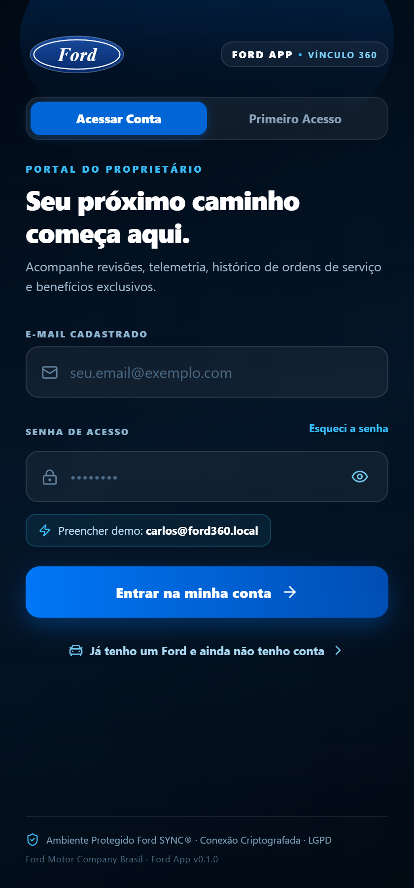 | 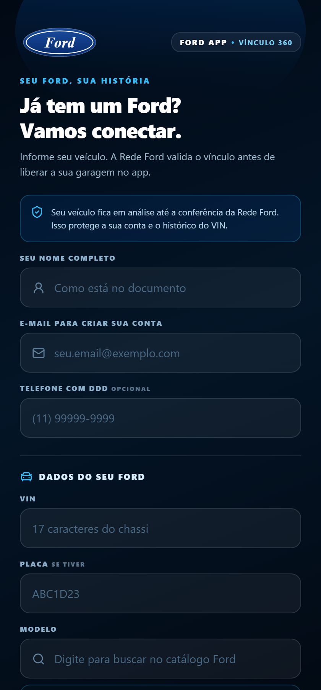 |
| **Login Seguro**: Autenticação com e-mail/senha, atalho rápido de demonstração e conformidade LGPD. | **Auto-Cadastro**: Registro autônomo do proprietário e associação do veículo por VIN e placa. |

---

### 2. Identidade Digital e Manutenção Preventiva
| Meu Ford (Home) | Próxima Revisão & Ofertas |
| :---: | :---: |
| 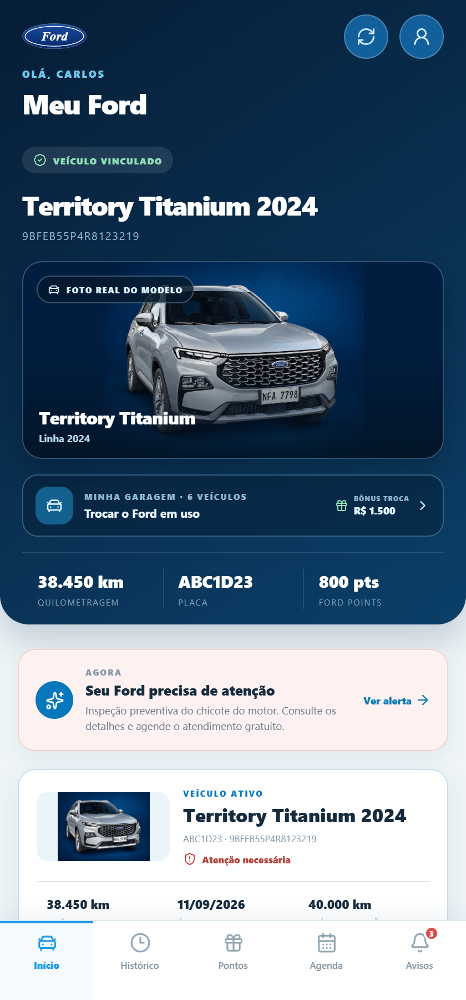 |  |
| **Identidade Vitalícia**: Modelo, odômetro, selo de garantia de fábrica e vínculo permanente pelo VIN. | **Manutenção Inteligente**: Cálculo preditivo de revisões periódicas e ofertas personalizadas. |

---

### 3. Minha Garagem Multiveicular e Bônus Troca
| Minha Garagem | Ficha Técnica Mecânica |
| :---: | :---: |
| 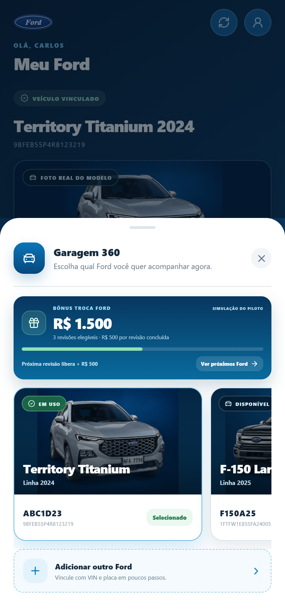 | 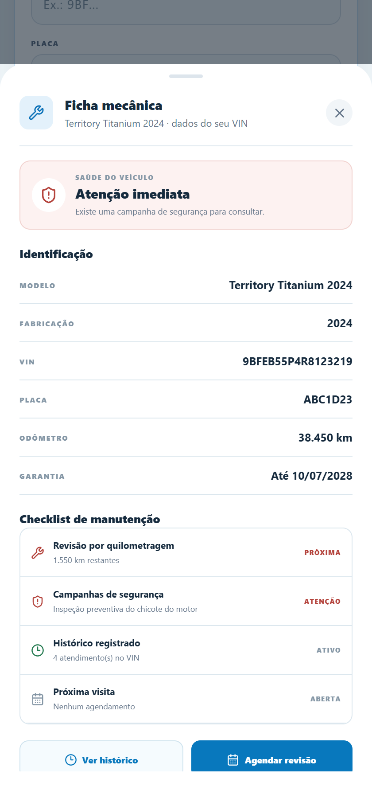 |
| **Garagem 360**: Gestão de múltiplos veículos Ford e simulação de **Bônus Troca** acumulado na rede. | **Ficha Completa**: Especificações oficiais de motorização, transmissão e prazos de garantia. |

---

### 4. Histórico Contínuo pelo VIN e Comprovante de OS
| Linha do Tempo de Revisões | Detalhes da Ordem de Serviço |
| :---: | :---: |
|  | 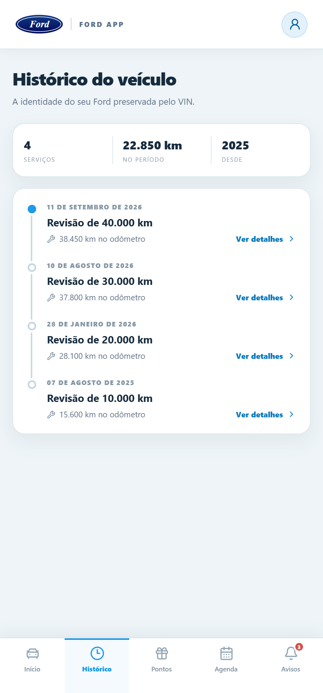 |
| **Histórico Vitalício**: Livro de bordo digital que permanece com o chassi mesmo após a troca de dono. | **Transparência**: Discriminação de peças, fluidos trocados, valores e carimbo técnico da autorizada. |

---

### 5. Programa Ford Pontos e Resgate de Vouchers
| Saldo e Extrato | Catálogo de Benefícios |
| :---: | :---: |
|  | 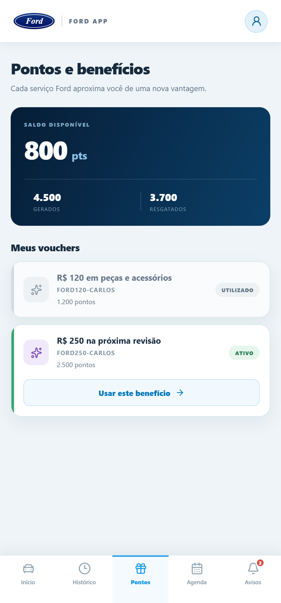 |
| **Recompensas**: Acúmulo automático de pontos a cada serviço concluído na rede Ford. | **Resgate Exclusivo**: Vouchers de desconto em revisões, serviços de oficina e acessórios. |

---

### 6. Agendamento Conectado e Central de Segurança
| Agendamento na Concessionária | Alertas e Recalls Oficiais |
| :---: | :---: |
| 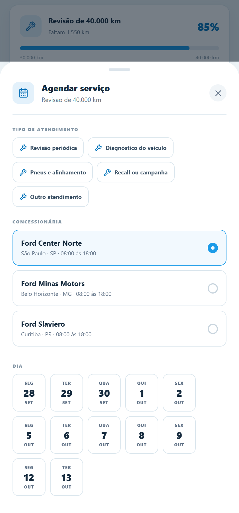 | 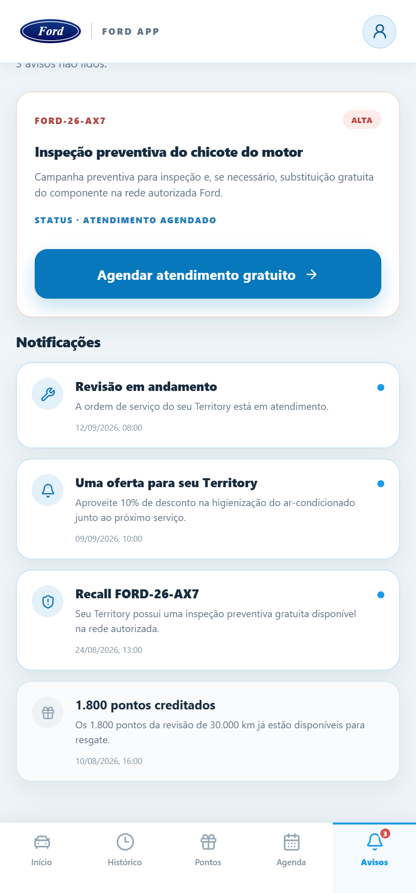 |
| **Agendamento em Tempo Real**: Escolha de serviço, concessionária e grade de horários da oficina. | **Segurança Máxima**: Notificação de recall oficial com agendamento prioritário e gratuito na rede. |

---

### 7. Vitrine de Novos Modelos & Oportunidade de Troca
| Showroom Digital Integrado |
| :---: |
| 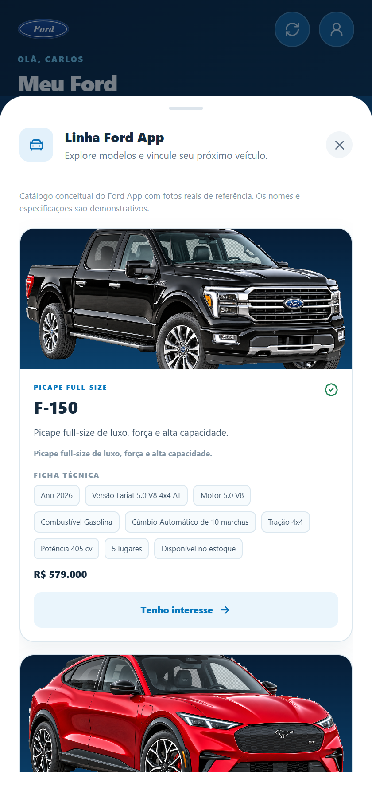 |
| **Catálogo de Lançamentos**: Conheça novos modelos Ford (Ranger, Maverick, Bronco, Territory) com manifestação direta de interesse aproveitando o bônus troca. |


Programa de fidelização

Além de centralizar os dados do veículo, o sistema criará incentivos para que o proprietário continue utilizando a rede Ford.

Exemplo:

Revisão realizada
        ↓
Cliente recebe pontos
        ↓
Acumula saldo
        ↓
Resgata voucher
        ↓
Utiliza em novo serviço Ford
        ↓
Retorna à concessionária

Isso cria um ciclo de fidelização:

Serviço → pontos → benefício → retorno → novo serviço.

Painel da concessionária

As concessionárias contam com um sistema web completo e responsivo para operação diária, relacionamento e pós-venda:

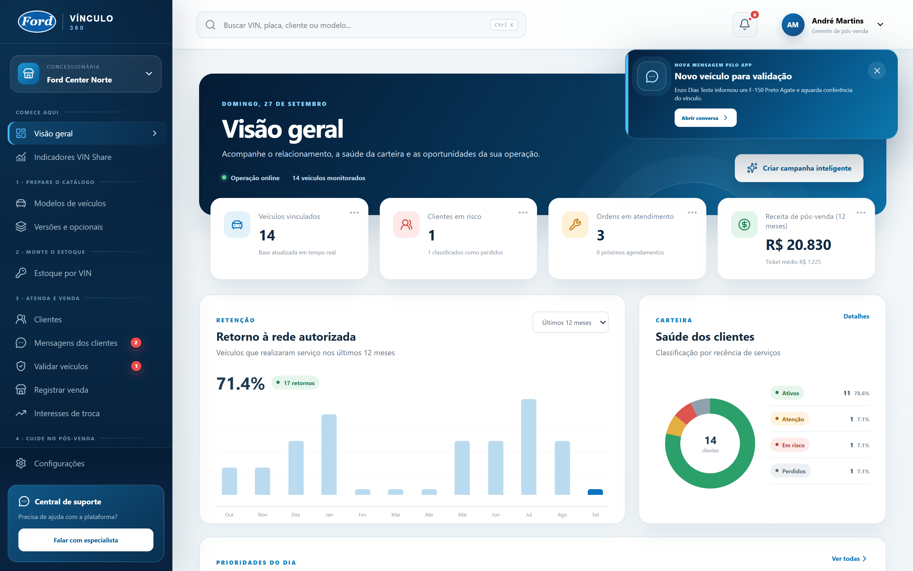
*Visão geral da concessionária: retenção de clientes em 12 meses, segmentação de risco, agendamentos e ordens em atendimento.*

O funcionário pode pesquisar qualquer veículo pelo VIN e visualizar o histórico completo daquele automóvel:

Por exemplo:

Ford Territory Titanium 2024

VIN: ****************3219
Quilometragem: 38.450 km

Última revisão:
12/03/2026

Próxima revisão:
40.000 km

Status do cliente:
EM RISCO

O painel web disponibiliza:

- **Pesquisa por VIN** e ficha completa do veículo com garantia;
- **Histórico contínuo de manutenção** e ordens de serviço;
- **Geração e validação de pontos e vouchers**;
- **Classificação automática da carteira** (Ativo, Atenção, Em Risco, Perdido);
- **Agenda inteligente** com capacidade e isolamento de slots;
- **Funil comercial de recompra** de seminovos.

| Gestão de Clientes (com LGPD) | Funil de Recompra de Usados |
| :---: | :---: |
| 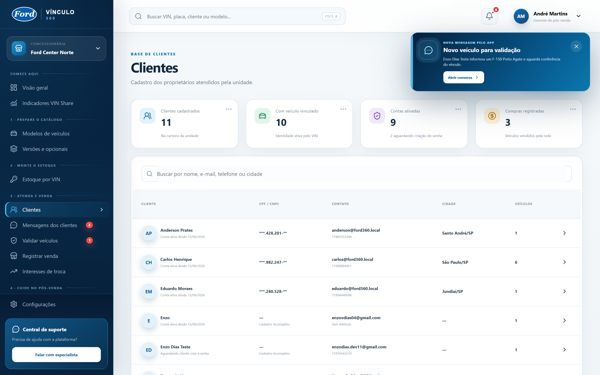 | 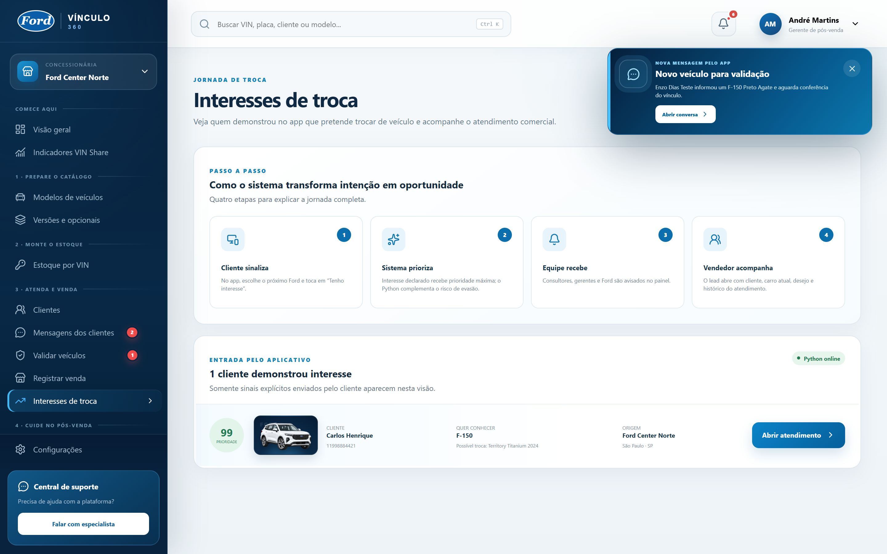 |
| **Privacidade**: CPF mascarado nas listagens e histórico seguro. | **Recompra**: Identificação automática de veículos em momento de troca. |

| Gestão de Campanhas | Estoque de Veículos com VIN Integrado |
| :---: | :---: |
| 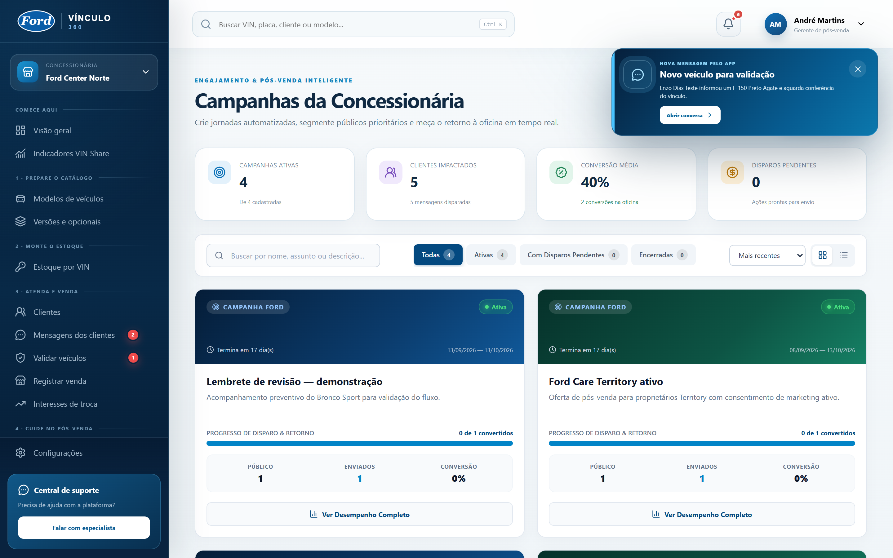 | 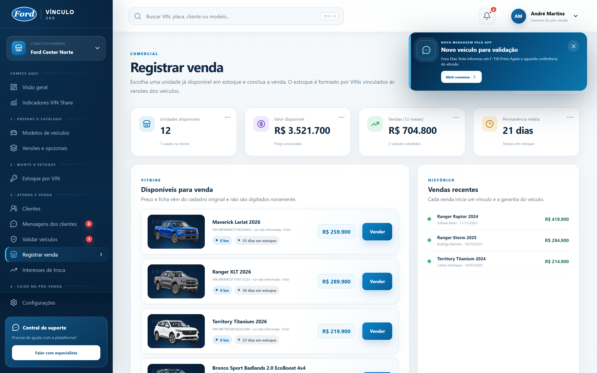 |
| **Comunicação**: Criação e disparo segmentado de campanhas. | **Estoque**: Veículos novos e seminovos preservando o histórico da máquina. |

Inteligência Artificial / Machine Learning

Um dos principais diferenciais será utilizar os dados históricos para identificar antecipadamente clientes que estão se afastando da rede Ford.

O sistema poderá analisar informações como:

Tempo desde a última revisão
Quilometragem
Idade do veículo
Quantidade de serviços realizados
Tempo desde a compra
Utilização de vouchers
Frequência na concessionária
Valor gasto em pós-venda

Com esses dados, o modelo de Machine Learning (`churn-risk-pilot-v1`) calcula em tempo real a probabilidade de evasão:

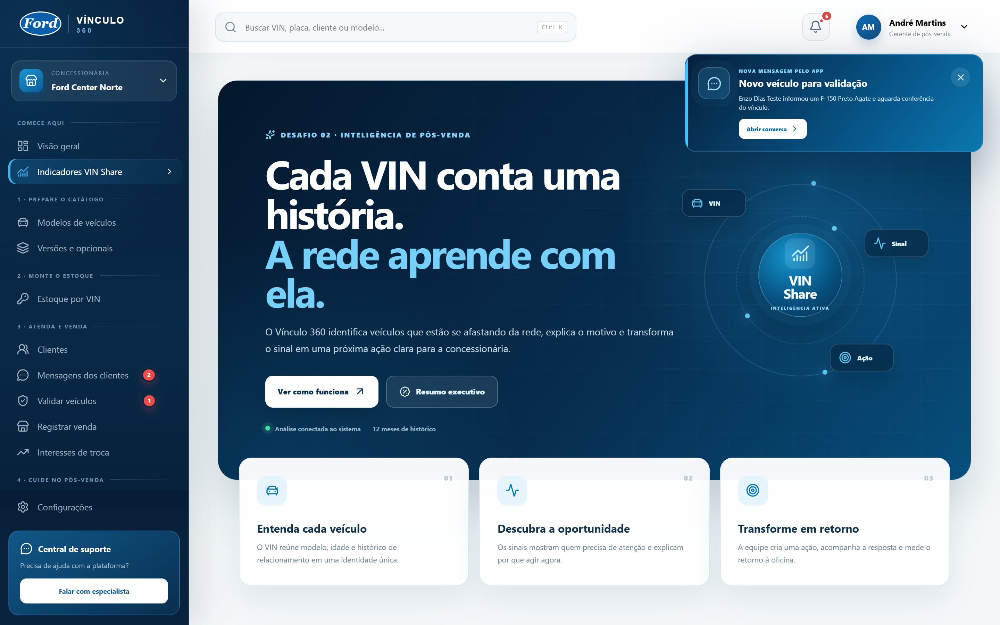
*Tela do Desafio 02: modelo treinado analisando 19 veículos da carteira e ranqueando os clientes com maior urgência de retorno.*

Por exemplo:

Cliente: Carlos

Ford Ranger 2022

Último serviço Ford:
410 dias atrás

Serviços nos últimos 24 meses:
1

Probabilidade de evasão:
87%

Classificação:
ALTO RISCO

A concessionária poderia então receber uma recomendação:

Ação recomendada:

Enviar campanha oferecendo
R$ 250 de desconto na próxima revisão.

Ou seja, em vez de esperar o cliente desaparecer, a Ford poderá identificar sinais de afastamento e agir antecipadamente.

Classificação dos clientes

O sistema poderá utilizar categorias como:

🟢 ATIVO

🟡 ATENÇÃO

🟠 EM RISCO

🔴 PERDIDO

Isso facilitará a visualização das oportunidades pela concessionária.

Oportunidades de pós-venda

O painel poderá automaticamente gerar leads.

Exemplo:

OPORTUNIDADES

142 clientes em alto risco

312 veículos próximos da revisão

87 clientes com potencial de troca

53 campanhas disponíveis

Assim, o sistema deixa de ser apenas um cadastro e passa a funcionar como uma ferramenta comercial.

Oportunidade de recompra

Outro ponto importante é utilizar o relacionamento de pós-venda para gerar oportunidades futuras de venda.

Por exemplo:

Ford Territory 2022

78.000 km
4 anos de utilização
Histórico completo de manutenção
Cliente ativo

Probabilidade de troca:
82%

A concessionária poderá transformar esse cliente em uma oportunidade para o setor comercial.

Isso cria o ciclo:

Compra do Ford
      ↓
Manutenção
      ↓
Fidelização
      ↓
Relacionamento
      ↓
Identificação da oportunidade
      ↓
Oferta de troca
      ↓
Compra de um novo Ford
Painel administrativo da Ford

Além do cliente e das concessionárias, a Ford terá uma visão consolidada da rede.

O painel poderá apresentar indicadores como:

quantidade de veículos cadastrados;
clientes ativos;
clientes em risco;
clientes recuperados;
quantidade de serviços;
utilização de vouchers;
desempenho das concessionárias;
desempenho por modelo;
comportamento por região;
evolução do VIN Share;
campanhas com maior conversão.

Por exemplo:

VIN SHARE

Brasil
67,4%

São Paulo
71%

Paraná
69%

Minas Gerais
65%

Ou:

VIN SHARE POR MODELO

Ranger       78%
Territory    74%
Maverick     71%
EcoSport     45%
Ka           39%

Com esses dados, a Ford pode identificar padrões e criar campanhas específicas.

Tecnologias propostas

Como arquitetura, a ideia é utilizar tecnologias modernas e manter grande parte do projeto em TypeScript.

Aplicativo Mobile

React Native + TypeScript + Expo

Responsável pelo aplicativo utilizado pelo proprietário do veículo.

React Native
TypeScript
Expo
Sistema Web

React + TypeScript + Vite

Responsável pelos painéis da concessionária e da Ford.

React
TypeScript
Vite

A interface será responsiva e poderá funcionar em computadores, tablets e outros dispositivos.

Backend

Node.js + NestJS + TypeScript

Será o núcleo da plataforma, responsável por:

autenticação;
usuários;
veículos;
proprietários;
concessionárias;
histórico;
serviços;
pontos;
vouchers;
campanhas;
permissões;
integrações;
regras de negócio.
Node.js
NestJS
TypeScript
REST API
JWT
Banco de dados

MySQL

Responsável pelo armazenamento das informações do sistema.

Durante o desenvolvimento podemos utilizar:

WampServer
+
MySQL

Da mesma forma que utilizamos atualmente no projeto Recapture.

Machine Learning

Python

Será utilizado especificamente para treinamento e execução dos modelos de Machine Learning.

Possíveis tecnologias:

Python
Pandas
Scikit-learn
NumPy
FastAPI

O backend NestJS poderá consultar esse serviço para obter as previsões.

Arquitetura simplificada
                       FORD VÍNCULO 360


              ┌───────────────────────┐
              │     React Native      │
              │    App do cliente     │
              └───────────┬───────────┘
                          │
                          │
                          ▼
              ┌───────────────────────┐
              │                       │
              │        NestJS         │
              │      REST API         │
              │                       │
              └───────┬───────┬───────┘
                      │       │
                      │       │
          ┌───────────┘       └────────────┐
          ▼                                ▼

┌─────────────────────┐           ┌─────────────────┐
│       MySQL         │           │    Python ML    │
│                     │           │                 │
│ Veículos            │           │ Previsão de     │
│ Clientes            │           │ evasão          │
│ Serviços            │           │                 │
│ Pontos              │           │ Classificação   │
│ Histórico           │           │ de clientes     │
└─────────────────────┘           └─────────────────┘


             ▲                         ▲
             │                         │
             └───────────┬─────────────┘
                         │
                         ▼

               ┌─────────────────┐
               │ React + Vite    │
               │                 │
               │ Concessionária  │
               │ Ford Admin      │
               └─────────────────┘
Principal diferencial

O diferencial da solução não é simplesmente criar um programa de pontos ou um cadastro de veículos.

A proposta é transformar o VIN em um elo permanente entre o veículo e o ecossistema Ford.

A partir dessa identidade é possível unir:

histórico do veículo + relacionamento + fidelização + dados + inteligência artificial + pós-venda + oportunidade de recompra.

Assim, mesmo que o veículo tenha vários proprietários ao longo de sua vida, ele poderá continuar conectado à plataforma.

Resumo da proposta

O Ford Vínculo 360 é uma plataforma de relacionamento e fidelização baseada na identidade permanente do veículo através do VIN. O sistema conecta proprietários, concessionárias e Ford em um único ecossistema, preservando o histórico do veículo, incentivando a realização de serviços na rede autorizada e utilizando Machine Learning para identificar clientes com risco de evasão. Com isso, a Ford pode agir de forma antecipada, criar campanhas personalizadas, aumentar o retorno às concessionárias e transformar o relacionamento de pós-venda em futuras oportunidades de recompra.

---

## Estrutura inicial do projeto

```text
apps/
  api/       NestJS + Prisma
  web/       React + Vite (painel da rede)
  mobile/    React Native + Expo (app do proprietário)
  ml/        FastAPI (baseline de previsão)
docs/        arquitetura, plano de entregas e LGPD
```

## Como executar localmente

Pré-requisitos: Node 20+, pnpm, Python 3.11+ e WampServer (MySQL ativo na porta 3306).

```bash
copy .env.example .env
copy apps\api\.env.example apps\api\.env
pnpm install
pnpm db:generate
pnpm db:migrate:initial
pnpm dev
```

Em outro terminal, inicie o serviço de previsão:

```bash
cd apps/ml
python -m venv .venv
.venv\Scripts\activate
pip install -r requirements.txt
uvicorn app.main:app --reload --port 8000
```

Endereços locais:

- Painel web: `http://localhost:5173`
- API: `http://localhost:3000/api/v1/health`
- Documentação da API: `http://localhost:3000/docs`
- ML: `http://localhost:8000/docs`

### Acessos de demonstração

As credenciais não são exibidas na tela de login. Todos os perfis abaixo usam a
senha `Ford@360`:

| Perfil | Acesso | Enxerga |
| --- | --- | --- |
| Administrador Ford | `admin@ford360.local` | Rede nacional completa, VIN Share e ranking das unidades |
| Gerente (SP) | `gerente@ford360.local` | Ford Center Norte — 7 veículos, agenda cheia, equipe |
| Consultora (SP) | `consultora@ford360.local` | Mesma unidade, sem gestão de equipe nem edição da unidade |
| Gerente (PR) | `gerente.pr@ford360.local` | Ford Slaviero — 3 veículos, 100% de retenção |
| Gerente (MG) | `gerente.mg@ford360.local` | Ford Minas Motors — 2 veículos, um cliente em risco |
| Proprietário | `carlos@ford360.local` | Apenas o próprio Territory, pontos, agenda e recalls |

### Roteiro sugerido de apresentação

1. **Visão geral (gerente SP)** — retenção de 12 meses, carteira classificada
   nas quatro faixas de risco e ordens em atendimento.
2. **Clientes** — base cadastral com busca; o CPF aparece mascarado e a ficha
   reúne dados, veículos com garantia e histórico de compras. **Risco e
   retenção** — o modelo de ML ordena a carteira por probabilidade de evasão e
   a lista prioritária vira campanha em um clique.
3. **Ficha do veículo** — histórico contínuo pelo VIN, proprietário atual sob
   LGPD e o score do modelo com a origem da previsão declarada.
4. **Agendamentos** — agenda do dia, ocupação da oficina e bloqueio automático
   fora do expediente ou com capacidade esgotada.
5. **Recompra** — funil comercial com valor estimado da carteira de usados.
6. **Ford Admin** — consolidação nacional, VIN Share por região e por família de
   modelo, com exportação do relatório.
7. **Configurações** — equipe, convites, sessões ativas por dispositivo e trilha
   de auditoria imutável.

### Preparar a base antes de apresentar

`pnpm db:seed` é idempotente e prepara uma base vazia: cria somente as
concessionárias, os acessos internos e a configuração básica. Clientes,
veículos, modelos, variações e movimentações devem nascer pelo fluxo real do
sistema. A antiga massa de demonstração continua disponível apenas de forma
explícita com `pnpm --filter @ford/api seed:demo`.

> Suba também o serviço de ML antes da apresentação. Sem ele o sistema continua
> funcionando, mas o painel passa a exibir "estimativa local" em vez de
> "classificação pelo modelo de Machine Learning treinado", e o health check da
> API responde `degraded`.

Os documentos em `docs/` registram as decisões iniciais e os limites obrigatórios de segurança e LGPD.

## Módulos disponíveis

- **Cadastro de clientes** em tela própria: nome, CPF (com validação dos dígitos
  verificadores e checagem de duplicidade), RG e órgão emissor, data de
  nascimento, contato e endereço completo com preenchimento automático pelo CEP.
  O CPF aparece **mascarado nas listagens** e completo apenas na ficha; cada
  criação ou alteração fica registrada na trilha de auditoria. A ficha do
  cliente reúne dados cadastrais, saldo de pontos, veículos vinculados com a
  garantia de cada um e o histórico de compras.
- **Estoque e vendas**: veículos disponíveis (novos e seminovos), venda com
  cadastro do cliente no ato, início da garantia e entrada do usado na troca.
  O usado retomado volta ao estoque **carregando o histórico do próprio VIN**,
  que passa a ser argumento de venda. A venda também fecha a oportunidade de
  recompra que a originou.
- Identidade permanente pelo VIN, vínculo e transferência de proprietário.
- Ordens de serviço, agendamentos, pontos, vouchers e campanhas.
- Agenda por concessionária com dias úteis, expediente, duração dos intervalos,
  capacidade simultânea e bloqueio de horários lotados.
- Risco de evasão pelo serviço Python e oportunidades de recompra com funil comercial.
- Recalls por VIN, notificação do proprietário e acompanhamento até a conclusão.
- Central de notificações no painel e avisos de segurança no aplicativo mobile.
- Gestão de concessionária, equipe, permissões e auditoria.
- Central de suporte persistente, com prioridades, fila por unidade, responsável,
  solução registrada e avisos automáticos.
- Convites de equipe com ativação em até 72 horas, recuperação de senha em até
  30 minutos, bloqueio de tentativas e revogação global das sessões.
- Access token curto mantido somente em memória, refresh token rotativo em cookie HttpOnly e painel de
  dispositivos com encerramento individual de acessos.
- Consentimentos revogáveis, solicitações LGPD e exportação dos dados do titular.
- Fila transacional de mensagens (e-mail, com SMS e push já mapeados no
  modelo), com templates, retentativas com backoff exponencial e
  rastreamento de entrega. Convites e recuperação de senha já disparam
  e-mail automaticamente; em desenvolvimento, sem `SMTP_HOST` configurado, um
  provedor simulado registra o conteúdo entregue para inspeção via
  `GET /api/v1/messaging` (perfil Administrador Ford). Com SMTP configurado,
  Administrador Ford ou Gerente pode validar o envio real em Configurações →
  Integrações → Enviar teste. Consulte [docs/email-setup.md](docs/email-setup.md)
  antes de colocar o piloto em campo.

## Verificação e backup

Com a API em execução, rode o smoke test completo:

```bash
pnpm test:smoke
pnpm test:scheduling
pnpm test:support-access
pnpm test:refresh-sessions
pnpm test:messaging
```

O teste de agenda confirma horários válidos, lotação máxima, bloqueio fora do
expediente e isolamento entre concessionárias. Os registros criados durante o
teste são cancelados automaticamente e não ocupam novas vagas.

O teste de suporte e acesso valida convite, ativação da conta, abertura e
tratamento de chamado, recuperação de senha e invalidação do token após a
revogação das sessões. Em desenvolvimento, os códigos aparecem na própria
interface; em produção, devem ser entregues pelo provedor transacional.

O teste de sessões valida a rotação do cookie HttpOnly, a invalidação do token
anterior, dois dispositivos simultâneos, revogação individual e logout.

O teste de mensageria valida que convite e recuperação de senha enfileiram
e-mail, que o conteúdo entregue fica registrado no rastreamento de eventos,
que uma mensagem já entregue não pode ser reenviada e que somente o
Administrador Ford acessa a fila.

Para gerar um backup versionado do banco MySQL do WampServer:

```bash
pnpm db:backup
```

Os arquivos são gravados na pasta local `backups/`, ignorada pelo controle de versão.
